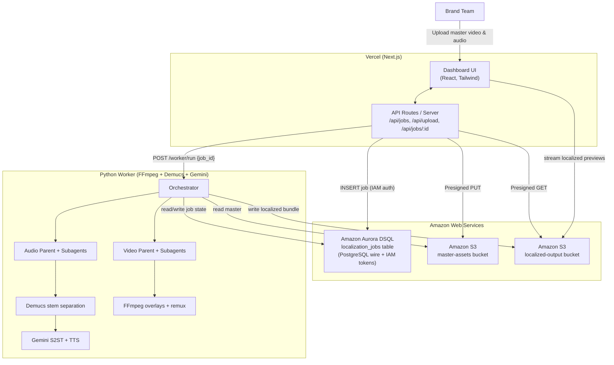

# 🐝 OmniSwarm — Global Ad Localization on AWS + Vercel

OmniSwarm is an autonomous, event-driven, multi-agent media localization platform. A brand team uploads a master creative pair (video + voiceover); a parallel agent hierarchy then automatically localizes the ad for multiple markets (Japan, Germany, India, English) — adapting visuals, translating scripts, separating audio stems (preserving background music while dubbing vocals), and producing CDN-ready localized ad bundles.

**H0 Hackathon stack:** the frontend is a **Next.js app deployed on Vercel**, application state lives in **Amazon Aurora DSQL**, and all media assets are stored in **Amazon S3**. The heavy media pipeline (FFmpeg + Demucs + Gemini) runs as a separate Python worker that shares the same Aurora DSQL cluster and S3 buckets.

> **AWS Database used: Amazon Aurora DSQL** (serverless, distributed, PostgreSQL-compatible, IAM-authenticated).

---

## 📐 System Architecture



---

## 🛠️ Technology Stack

| Layer | Technology |
|---|---|
| **Frontend & API** | **Next.js 14** (App Router, TypeScript, Tailwind) on **Vercel** |
| **Database** | **Amazon Aurora DSQL** — PostgreSQL-compatible, accessed from Node via `pg` + `@aws-sdk/dsql-signer`, and from Python via `psycopg` + boto3 IAM tokens |
| **Object storage** | **Amazon S3** — master + localized-output buckets, browser access via presigned URLs |
| **Media worker** | Python 3.11 · FastAPI · FFmpeg · **Facebook Demucs** (stem separation) · **Google Gemini 2.5 Flash** (translation + TTS) |

---

## 📂 Project Structure

```
.
├── web/                         # Next.js app (deployed to Vercel)
│   ├── src/app/                 # pages + API routes
│   │   ├── page.tsx
│   │   └── api/{jobs,upload,health}/route.ts
│   ├── src/components/Dashboard.tsx
│   ├── src/lib/                 # aws.ts, db.ts (Aurora DSQL), s3.ts, jobs.ts, markets.ts, worker.ts
│   ├── db/schema.sql            # Aurora DSQL schema
│   └── .env.example
│
├── src/                         # Python worker (media pipeline)
│   ├── config.py                # settings (AWS / DSQL / S3)
│   ├── database.py              # Aurora DSQL data layer (SQLite fallback)
│   ├── storage.py               # Amazon S3 storage layer
│   ├── orchestrator.py          # pipeline supervisor (run_job)
│   ├── agents.py                # video/audio agent hierarchy
│   ├── media_processor.py       # FFmpeg + Demucs + Gemini
│   └── webhook.py               # FastAPI: POST /worker/run
│
├── scripts/provision_aws.sh     # creates Aurora DSQL cluster + S3 buckets
├── requirements.txt             # Python deps (adds psycopg)
├── render.yaml                  # optional worker hosting (Render)
└── .env.example
```

---

## 🚀 Provisioning the AWS backend

Requires the AWS CLI configured with credentials allowed to call `dsql:*` and `s3:*`.

```bash
REGION=us-east-1 ./scripts/provision_aws.sh
```

This creates an Aurora DSQL cluster + two S3 buckets and prints the env values
(`DSQL_ENDPOINT`, `S3_MASTER_BUCKET`, `S3_OUTPUT_BUCKET`). Then apply the schema:

```bash
PGSSLMODE=require psql \
  "host=<DSQL_ENDPOINT> user=admin dbname=postgres \
   password=$(aws dsql generate-db-connect-admin-auth-token --region us-east-1 --hostname <DSQL_ENDPOINT>)" \
  -f web/db/schema.sql
```

---

## 🌐 Deploying the frontend to Vercel

```bash
cd web
vercel            # link / create the project
vercel env add APP_AWS_REGION
vercel env add APP_AWS_ACCESS_KEY_ID
vercel env add APP_AWS_SECRET_ACCESS_KEY
vercel env add DSQL_ENDPOINT
vercel env add S3_MASTER_BUCKET
vercel env add S3_OUTPUT_BUCKET
vercel env add WORKER_URL
vercel env add WORKER_AUTH_TOKEN
vercel --prod     # deploy
```

> Env vars use the `APP_AWS_*` prefix on purpose: Vercel functions run on AWS
> Lambda, whose reserved `AWS_*` variables hold Vercel's own credentials.

---

## 🧑‍🔧 Running the worker

```bash
python3 -m venv venv && source venv/bin/activate
pip install -r requirements.txt
cp .env.example .env   # fill in AWS creds, DSQL_ENDPOINT, buckets, WORKER_AUTH_TOKEN
./run.sh               # FastAPI worker on :3001 (POST /worker/run)
```

For offline development leave `DSQL_ENDPOINT` empty (SQLite fallback) and
`S3_LIVE_MODE=False` (local filesystem storage emulator).

---

## 🔄 End-to-end flow

1. Brand team enters a campaign + markets in the Vercel dashboard and uploads the master video/voiceover (presigned PUT → S3).
2. `POST /api/jobs` inserts a `localization_jobs` row into **Aurora DSQL** and calls the worker's `POST /worker/run`.
3. The worker runs the parallel video/audio agent trees: FFmpeg visual overlays, Demucs stem separation, Gemini translation + TTS, then FFmpeg remux.
4. Localized bundles are uploaded to the **S3 output bucket**; results + live logs are written back to Aurora DSQL.
5. The dashboard polls Aurora DSQL and streams the original vs. localized previews via presigned S3 URLs.
