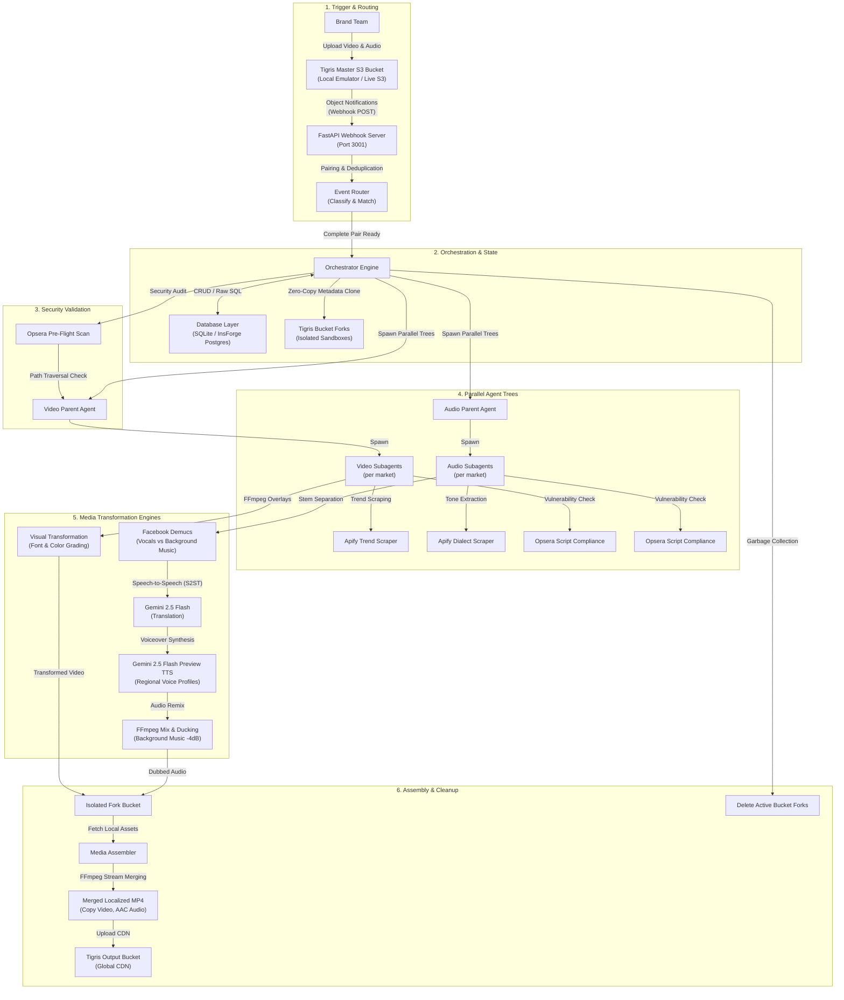

# 🐝 OmniSwarm — Global Ad Localization Pipeline

OmniSwarm is an autonomous, event-driven, multi-agent media processing and localization platform. When a master creative asset pair (video and audio) is uploaded to Tigris S3 storage, it triggers a parallel agent hierarchy that automatically localizes the ad campaign for multiple target markets (e.g., Japan, Germany, India, and English-speaking markets) without manual intervention.

The platform adapts visual styles, translates scripts, separates audio stems (preserving background music while dubbing vocals via Google Gemini S2ST), enforces strict security controls via Opsera script validation, and outputs a final, CDN-ready localized ad bundle.

---

## 📐 System Architecture

The following diagram illustrates the end-to-end media localization pipeline, from the S3 upload trigger down to agent execution, security gates, and final asset assembly:



---

## 🛠️ Technology Stack

- **Core Runtime**: Python 3.11+
- **API Framework**: FastAPI & Uvicorn (Port 3001) for webhook reception and validation.
- **Monitoring UI**: Streamlit (Port 3002) for real-time logs, live job tracking, and side-by-side previews.
- **Database (BaaS)**: [InsForge](https://insforge.dev) Serverless Postgres (via HTTP SQL gateway) with a local SQLite fallback (`jobs.db`).
- **Object Storage**: S3-compatible Tigris storage with automatic fallback to local emulated filesystem storage (`storage/`).
- **GenAI / Multimodal translation**:
  - **Google Gemini 2.5 Flash**: Contextual transcription and translation of vocals.
  - **Google Gemini 2.5 Flash Preview TTS**: Premium voiceover synthesis utilizing regional voice profiles (`Aoede` for Japan, `Charon` for Germany, `Kore` for India, `Puck` for English).
- **Media Processing**:
  - **Facebook Demucs (v4)**: Deep learning model for source separation (splitting vocals from background instrumental tracks).
  - **FFmpeg**: Color grading adjustments, multilingual subtitles drawtext overlays, audio resampling, and container stream-merging (AAC audio + H.264 video).

---

## 📂 Project Structure

```
omniswarm/
├── .env.example                # Template for environment configuration keys
├── AGENTS.md                   # InsForge client configuration details
├── jobs.db                     # Local SQLite database (auto-created)
├── render.yaml                 # Infrastructure configuration for Render deployment
├── render-build.sh             # Build script for production (installs FFmpeg static binary)
├── requirements.txt            # Python dependencies (FastAPI, Streamlit, Demucs, Gemini SDK, etc.)
├── run.sh                      # Shell launcher for starting both server components in development
│
├── src/
│   ├── __init__.py
│   ├── config.py               # Env settings parser & target market configurations
│   ├── database.py             # Schema setups, job status mapping, SQL queries
│   ├── storage.py              # Cloud storage layer & Zero-Copy bucket fork operations
│   ├── router.py               # Incoming asset classifier and file pairing tracker
│   ├── webhook.py              # FastAPI endpoints for Tigris S3 notifications
│   ├── orchestrator.py         # Job scheduler, bucket fork setup, pipeline supervisor, remuxer
│   ├── agents.py               # Video/Audio agent class hierarchies and script validation
│   ├── media_processor.py      # FFmpeg pipelines, Demucs executor, and Gemini S2ST wrappers
│   │
│   └── utils/
│       ├── logger.py           # Standardized application-wide logging formats
│       └── idempotency.py      # Deduplication logic to filter duplicate webhook uploads
│
├── scripts/
│   └── download_kokila.py     # Script to pre-download Kokila font for Indian/Devanagari overlays
│
└── storage/                    # Emulated bucket directories for offline testing
    ├── master/                 # Emulated Tigris Master Bucket
    └── output/                 # Emulated Tigris Output Bucket
```

---

## 🔄 Step-by-Step Pipeline Flow

1. **Asset Upload**: The brand team uploads `master.mp4` (video) and `voiceover.wav` (audio) under the campaign directory: `campaigns/{campaign_id}/`.
2. **Object Notification**: Tigris issues S3 Object Created events to the FastAPI webhook endpoint `/webhook/tigris`.
3. **Asset Pairing**: The `router` parses key prefixes to extract the `campaign_id`. It queues individual files until both the video and audio parts have landed for that campaign, preventing partial execution.
4. **Opsera Pre-Flight Scan**: Checks S3 keys for path traversal (`..` patterns) and secures credentials.
5. **Zero-Copy Bucket Forking**: The orchestrator clones the source bucket to generate isolated workspaces for each market-asset pair (e.g., `job-[id]-japan-video`). If `TIGRIS_LIVE_MODE` is enabled, it sends an S3 `CreateBucket` request with the custom header `X-Tigris-Fork-Source-Bucket`. Tigris executes a zero-copy metadata clone instantly, which isolates testing environments and minimizes cloud storage costs.
6. **Parallel Agent Trees**:
   - **VideoParentAgent** spawns market-specific **VideoSubagents**:
     - Crawl local design trends using Apify.
     - Generate a visual strategy script, audited by Opsera.
     - Run local FFmpeg to apply font styling (e.g., *Noto Sans JP* for Japan, *Noto Sans Devanagari* for India) and color filters (e.g., saturated theme for India, high-contrast overlay for Japan).
   - **AudioParentAgent** spawns market-specific **AudioSubagents**:
     - Crawl local dialect trends using Apify.
     - Generate an audio strategy script, audited by Opsera.
     - Isolate voice and background music using Facebook **Demucs**.
     - Feed clean vocals into **Gemini 2.5 Flash** for translation.
     - Run **Gemini 2.5 Flash Preview TTS** to synthesize voiceover with market voice profiles.
     - Mix the synthesized voiceover back with the background music, ducking the music by `-4dB` to guarantee vocal clarity.
7. **Asset Remix Assembly**: The orchestrator downloads the processed video and audio tracks, merges them using FFmpeg (copying H.264 video, encoding audio to AAC), and uploads the package to the `TIGRIS_OUTPUT_BUCKET`.
8. **Forks Cleanup**: All active bucket forks are deleted (garbage collection) to clean up intermediate files.
9. **Dashboard Monitoring**: The job state is updated, showing logs and side-by-side previews of the original vs. localized video on the Streamlit dashboard.

---

## 🔑 Key Architectural Features

### 🐳 Zero-Copy Bucket Forks
Rather than copying physical bytes across buckets, which consumes time and bandwidth, the storage client instructs Tigris to perform a zero-copy metadata-only clone:
```python
def create_bucket_fork(source_bucket: str, fork_name: str):
    # Live storage mode intercepts the CreateBucket S3 call to inject custom headers
    s3.meta.events.register("before-send.s3.CreateBucket", add_fork_headers)
    s3.create_bucket(Bucket=fork_name)
```
This guarantees complete execution isolation: if an agent fails or writes corrupt files, the source bucket is untouched, and only the metadata pointers are deleted during garbage collection.

### 🎙️ AI Speech-to-Speech Translation (S2ST) with Music Preservation
Standard translators dub the entire audio track, obliterating background soundtracks. OmniSwarm uses a multi-layered approach:
1. **Stem Extraction**: `demucs --two-stems vocals` splits the audio into `vocals.flac` and `no_vocals.flac` (music background).
2. **Translation**: `gemini-2.5-flash` transcribes and translates vocals text.
3. **Voice Synthesis**: `gemini-2.5-flash-preview-tts` generates vocal files in the target language using specified voices.
4. **Remixing**: FFmpeg blends vocals back with the ducked music track:
   `[vocals][music_ducked] amix=inputs=2:duration=longest`

### 🛡️ Opsera Script & Configuration Scan
Before agents execute dynamic visual overlay or translation strategy configurations, their parameters are scanned to prevent malicious payloads:
```python
suspicious = ["eval(", "http://malicious.com", "api_key = \"secret\""]
for pattern in suspicious:
    if pattern in script_content:
        raise PermissionError("Security validator rejected the strategy script")
```

---

## ⚙️ Environment Configuration

Create a `.env` file in the root directory based on `.env.example`:

```env
# === Mock Modes ===
MOCK_SERVICES=True          # Toggle to run without external API keys (simulates Gemini & S3)
TIGRIS_LIVE_MODE=False       # Set to True to connect to a live Tigris S3 endpoint
GEMINI_LIVE_MODE=False       # Set to True to run live Gemini Translation + TTS

# === Server Configuration ===
WEBHOOK_PORT=3001
WEBHOOK_AUTH_TOKEN=your-bearer-token
DASHBOARD_PORT=3002

# === Target Markets (comma-separated list) ===
TARGET_MARKETS=japan,germany,india,english

# === Storage Configuration ===
TIGRIS_ACCESS_KEY_ID=tid_youraccesskey
TIGRIS_SECRET_ACCESS_KEY=tsec_yoursecretkey
TIGRIS_ENDPOINT=https://t3.storage.dev
TIGRIS_MASTER_BUCKET=mcdonalds-master-assets
TIGRIS_OUTPUT_BUCKET=mcdonalds-localized-output

# === Production APIs ===
GEMINI_API_KEY=your_gemini_api_key

# === InsForge Connection (Optional) ===
INSFORGE_BASE_URL=https://uw5cafb3.us-east.insforge.app
INSFORGE_API_KEY=your_insforge_api_key
```

---

## 🚀 Running Locally

### 1. Prerequisites
- **Python 3.11+** installed.
- **FFmpeg** installed and added to your system path (required for video/audio mixing).

### 2. Setup Virtual Environment
```bash
# Create virtual environment
python3 -m venv venv

# Activate virtual environment
source venv/bin/activate

# Install dependencies
pip install -r requirements.txt
```

### 3. Launch Development Servers
Run the launcher script to start both the FastAPI webhook server (port 3001) and the Streamlit monitoring dashboard (port 3002) concurrently:
```bash
./run.sh
```

### 4. Simulating a Campaign Pipeline
1. Open the dashboard at `http://localhost:3002`.
2. Type in a **Campaign ID** in the sidebar (e.g., `burger_campaign`).
3. Click **Trigger Agent Swarm**.
4. The dashboard will automatically generate dummy offline video and audio test files, send a mock upload event payload to the FastAPI webhook, and show real-time processing logs in the console.

---

## 🌐 Production Deployment

The project is pre-configured for direct deployment on **Render** (as defined in `render.yaml`):

1. **Services Configured**:
   - `omniswarm-webhook`: Runs the FastAPI server (`uvicorn src.webhook:app`).
   - `omniswarm-dashboard`: Runs the public Streamlit app (`streamlit run src/dashboard.py`).
2. **Build Lifecycle (`render-build.sh`)**:
   - Upgrades pip and installs project packages listed in `requirements.txt`.
   - Downloads a static **FFmpeg x86_64** package automatically if FFmpeg is not found globally. This circumvents the lack of root/sudo permissions on Render cloud servers.
