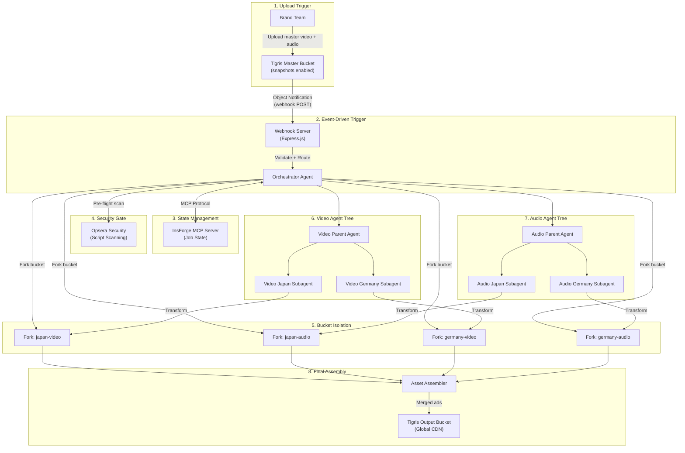
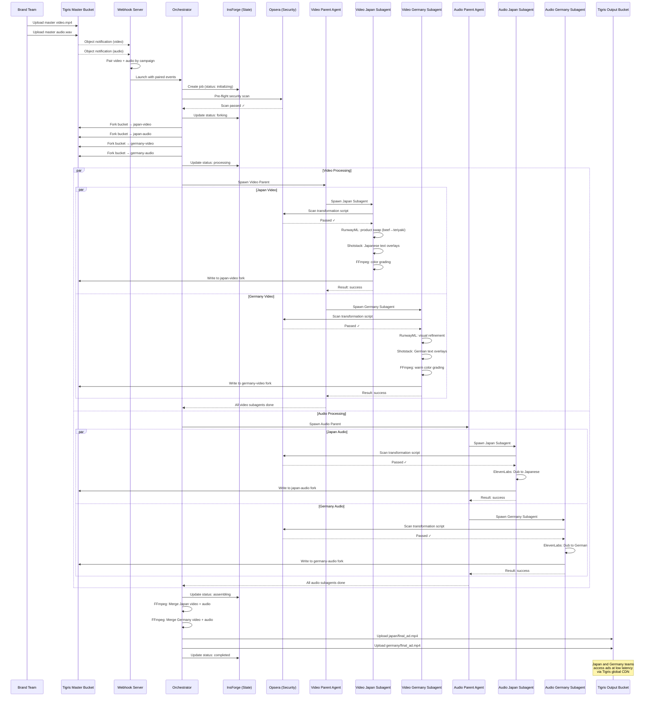

# Canva Content Swarm — Global Ad Localization Pipeline

A master American ad (video + audio) is uploaded to Tigris. Object notifications trigger an AI agent swarm that localizes the ad for Japan and Germany in parallel — adapting visuals, voiceover, and cultural context — with zero manual intervention.

---

## System Architecture Overview



---

## User Review Required

> [!IMPORTANT]
> **AI API Selection** — This plan uses **ElevenLabs** for audio dubbing and **Shotstack + RunwayML** for video transformation. These are credit-based services with per-minute pricing. Confirm acceptable cost thresholds per localization job before implementation.

> [!IMPORTANT]
> **Deployment Target** — The plan assumes deployment on **Fly.io** (Tigris's native hosting partner) for minimal latency to Tigris storage. If a different cloud provider is preferred, the Tigris endpoint and webhook configuration remain the same, but deployment scripts will differ.

> [!WARNING]
> **InsForge MCP** — InsForge is a relatively new platform. The plan uses its MCP server for job state management. If InsForge access is not available, a fallback design using a **PostgreSQL + custom MCP server** is included in Component 10.

> [!CAUTION]
> **Opsera Scanning** — Opsera's free tier supports <10 developers with 4 agents. For production workloads with many concurrent localization jobs, an Individual Agent ($9/user/mo) or Full Bundle ($28/user/mo) plan may be required.

---

## Open Questions

1. **API Keys** — Do you already have accounts/API keys for: Tigris, ElevenLabs, RunwayML, Shotstack, InsForge, Opsera? Or should the plan include account setup instructions?
2. **Additional Markets** — The plan supports Japan and Germany as the initial targets. Should the architecture be designed to trivially add more markets (e.g., Brazil, India, France) via configuration only?
3. **Human-in-the-Loop** — Should there be a review/approval step before final localized assets are published, or is fully autonomous end-to-end acceptable?
4. **Video Complexity** — How complex is the master video? If it's a template-based ad (text overlays, product shots), Shotstack/Creatomate works best. If it requires deep visual transformation (face swap, scene generation), RunwayML is needed. Or both?
5. **Dashboard** — Should this include a real-time monitoring dashboard (web UI) showing job progress, or is CLI/log output sufficient?

---

## Proposed Changes

### Component 1: Project Scaffolding

#### [NEW] Project Structure

```
canva-content-swarm/
├── package.json
├── tsconfig.json
├── .env.example
├── .env
├── docker-compose.yml
├── Dockerfile
│
├── src/
│   ├── index.ts                      # Application entry point
│   ├── config/
│   │   ├── env.ts                    # Environment variable validation (Zod)
│   │   ├── tigris.ts                 # Tigris S3 client configuration
│   │   ├── markets.ts                # Market definitions (Japan, Germany, extensible)
│   │   └── ai-services.ts            # API client configs for ElevenLabs, Runway, Shotstack
│   │
│   ├── webhook/
│   │   ├── server.ts                 # Express webhook server
│   │   ├── validator.ts              # Webhook payload validation + signature verification
│   │   └── router.ts                 # Routes object events to orchestrator
│   │
│   ├── orchestrator/
│   │   ├── orchestrator.ts           # Main orchestrator agent logic
│   │   ├── job-manager.ts            # Job lifecycle management
│   │   ├── fork-manager.ts           # Tigris bucket fork creation/cleanup
│   │   └── assembly.ts              # Final asset assembly + merge
│   │
│   ├── agents/
│   │   ├── base-agent.ts             # Abstract base agent class
│   │   ├── video/
│   │   │   ├── video-parent-agent.ts # Video parent agent (spawns regional subagents)
│   │   │   ├── video-subagent.ts     # Regional video transformation subagent
│   │   │   ├── strategies/
│   │   │   │   ├── japan-video.ts    # Japan-specific video transformation strategy
│   │   │   │   └── germany-video.ts  # Germany-specific video transformation strategy
│   │   │   └── processors/
│   │   │       ├── scene-adapter.ts   # AI scene/object replacement (RunwayML)
│   │   │       ├── text-overlay.ts    # Text overlay localization (Shotstack)
│   │   │       └── template-render.ts # Template-based video rendering
│   │   │
│   │   └── audio/
│   │       ├── audio-parent-agent.ts  # Audio parent agent (spawns regional subagents)
│   │       ├── audio-subagent.ts      # Regional audio transformation subagent
│   │       ├── strategies/
│   │       │   ├── japan-audio.ts     # Japan-specific audio localization strategy
│   │       │   └── germany-audio.ts   # Germany-specific audio localization strategy
│   │       └── processors/
│   │           ├── dubbing.ts         # ElevenLabs dubbing integration
│   │           ├── tts.ts             # Text-to-speech fallback
│   │           └── audio-mixer.ts     # Background audio preservation + mixing
│   │
│   ├── state/
│   │   ├── insforge-client.ts        # InsForge MCP client
│   │   ├── job-state.ts              # Job state types + transitions
│   │   └── fallback-state.ts         # PostgreSQL fallback state store
│   │
│   ├── security/
│   │   ├── opsera-client.ts          # Opsera API/MCP client
│   │   ├── scanner.ts                # Pre-execution script scanner
│   │   └── compliance.ts             # Regional compliance rules (GDPR, APPI)
│   │
│   ├── storage/
│   │   ├── tigris-client.ts          # Tigris S3 operations (upload, download, list)
│   │   ├── fork-operations.ts        # Bucket fork CRUD via S3 API + custom headers
│   │   └── asset-manager.ts          # Asset download/upload helpers
│   │
│   ├── dashboard/
│   │   ├── server.ts                 # Dashboard API server (WebSocket + REST)
│   │   ├── routes.ts                 # Dashboard API routes
│   │   └── public/                   # Static dashboard UI files
│   │       ├── index.html
│   │       ├── styles.css
│   │       └── app.js
│   │
│   └── utils/
│       ├── logger.ts                 # Structured logging (Pino)
│       ├── retry.ts                  # Exponential backoff retry logic
│       ├── idempotency.ts            # Deduplication for at-least-once delivery
│       └── events.ts                 # Internal event bus (EventEmitter)
│
├── tests/
│   ├── unit/
│   │   ├── orchestrator.test.ts
│   │   ├── fork-manager.test.ts
│   │   ├── video-subagent.test.ts
│   │   ├── audio-subagent.test.ts
│   │   └── scanner.test.ts
│   └── integration/
│       ├── webhook-to-orchestrator.test.ts
│       ├── tigris-fork.test.ts
│       └── end-to-end.test.ts
│
└── scripts/
    ├── setup-tigris.sh               # Bucket creation + snapshot enable + webhook config
    ├── setup-insforge.sh             # InsForge project + schema setup
    └── seed-test-data.sh             # Upload sample video/audio for testing
```

**Technology Stack:**
- **Runtime**: Node.js 20+ with TypeScript
- **Framework**: Express.js (webhook server) + WebSocket (dashboard)
- **Storage**: Tigris (S3-compatible via `@aws-sdk/client-s3`)
- **AI - Audio**: ElevenLabs Dubbing API
- **AI - Video**: Shotstack Edit API + RunwayML Gen-3 API
- **State**: InsForge MCP (primary) / PostgreSQL (fallback)
- **Security**: Opsera MCP + REST API
- **Logging**: Pino (structured JSON logs)
- **Testing**: Vitest
- **Deployment**: Docker → Fly.io

---

### Component 2: Environment Configuration

#### [NEW] [.env.example](file:///Users/jainilrana/.gemini/antigravity/scratch/canva-content-swarm/.env.example)

```env
# === Tigris Object Storage ===
TIGRIS_ACCESS_KEY_ID=tid_xxxxxxxxxxxx
TIGRIS_SECRET_ACCESS_KEY=tsec_xxxxxxxxxxxx
TIGRIS_ENDPOINT=https://t3.storage.dev
TIGRIS_REGION=auto
TIGRIS_MASTER_BUCKET=mcdonalds-master-assets
TIGRIS_OUTPUT_BUCKET=mcdonalds-localized-output

# === Webhook Server ===
WEBHOOK_PORT=3001
WEBHOOK_SECRET=your-webhook-signing-secret
WEBHOOK_AUTH_TOKEN=your-bearer-token

# === ElevenLabs (Audio Dubbing) ===
ELEVENLABS_API_KEY=sk_xxxxxxxxxxxx

# === RunwayML (Video Transformation) ===
RUNWAYML_API_KEY=rw_xxxxxxxxxxxx

# === Shotstack (Template Video Editing) ===
SHOTSTACK_API_KEY=xxxxxxxxxxxx
SHOTSTACK_ENV=v1  # v1 = sandbox, production for live

# === InsForge (State Management via MCP) ===
INSFORGE_MCP_URL=https://mcp.insforge.dev
INSFORGE_API_KEY=xxxxxxxxxxxx
INSFORGE_PROJECT_ID=canva-content-swarm

# === Opsera (Security Scanning) ===
OPSERA_MCP_URL=https://mcp.opsera.io/mcp
OPSERA_API_TOKEN=xxxxxxxxxxxx

# === Dashboard ===
DASHBOARD_PORT=3002

# === Target Markets (comma-separated) ===
TARGET_MARKETS=japan,germany

# === Logging ===
LOG_LEVEL=info
NODE_ENV=development
```

#### [NEW] [config/env.ts](file:///Users/jainilrana/.gemini/antigravity/scratch/canva-content-swarm/src/config/env.ts)

```typescript
import { z } from 'zod';

const envSchema = z.object({
  TIGRIS_ACCESS_KEY_ID: z.string().startsWith('tid_'),
  TIGRIS_SECRET_ACCESS_KEY: z.string().startsWith('tsec_'),
  TIGRIS_ENDPOINT: z.string().url().default('https://t3.storage.dev'),
  TIGRIS_REGION: z.string().default('auto'),
  TIGRIS_MASTER_BUCKET: z.string(),
  TIGRIS_OUTPUT_BUCKET: z.string(),
  WEBHOOK_PORT: z.coerce.number().default(3001),
  WEBHOOK_SECRET: z.string(),
  WEBHOOK_AUTH_TOKEN: z.string(),
  ELEVENLABS_API_KEY: z.string(),
  RUNWAYML_API_KEY: z.string(),
  SHOTSTACK_API_KEY: z.string(),
  SHOTSTACK_ENV: z.enum(['v1', 'production']).default('v1'),
  INSFORGE_MCP_URL: z.string().url(),
  INSFORGE_API_KEY: z.string(),
  INSFORGE_PROJECT_ID: z.string(),
  OPSERA_MCP_URL: z.string().url(),
  OPSERA_API_TOKEN: z.string(),
  DASHBOARD_PORT: z.coerce.number().default(3002),
  TARGET_MARKETS: z.string().transform(s => s.split(',')),
  LOG_LEVEL: z.enum(['debug', 'info', 'warn', 'error']).default('info'),
  NODE_ENV: z.enum(['development', 'production', 'test']).default('development'),
});

export type Env = z.infer<typeof envSchema>;
export const env = envSchema.parse(process.env);
```

---

### Component 3: Tigris Storage Layer

#### [NEW] [storage/tigris-client.ts](file:///Users/jainilrana/.gemini/antigravity/scratch/canva-content-swarm/src/storage/tigris-client.ts)

Core S3 client configured for Tigris with all storage operations.

```typescript
import {
  S3Client,
  PutObjectCommand,
  GetObjectCommand,
  ListObjectsV2Command,
  CreateBucketCommand,
  DeleteBucketCommand,
} from '@aws-sdk/client-s3';
import { env } from '../config/env';

// Singleton Tigris-configured S3 client
export const tigrisClient = new S3Client({
  region: env.TIGRIS_REGION,         // "auto"
  endpoint: env.TIGRIS_ENDPOINT,     // "https://t3.storage.dev"
  forcePathStyle: false,
  credentials: {
    accessKeyId: env.TIGRIS_ACCESS_KEY_ID,
    secretAccessKey: env.TIGRIS_SECRET_ACCESS_KEY,
  },
});

export async function uploadAsset(
  bucket: string,
  key: string,
  body: Buffer | ReadableStream,
  contentType: string
): Promise<void> {
  await tigrisClient.send(new PutObjectCommand({
    Bucket: bucket,
    Key: key,
    Body: body,
    ContentType: contentType,
  }));
}

export async function downloadAsset(
  bucket: string,
  key: string
): Promise<Buffer> {
  const response = await tigrisClient.send(new GetObjectCommand({
    Bucket: bucket,
    Key: key,
  }));
  return Buffer.from(await response.Body!.transformToByteArray());
}

export async function listAssets(
  bucket: string,
  prefix?: string
): Promise<string[]> {
  const response = await tigrisClient.send(new ListObjectsV2Command({
    Bucket: bucket,
    Prefix: prefix,
  }));
  return (response.Contents ?? []).map(obj => obj.Key!);
}
```

#### [NEW] [storage/fork-operations.ts](file:///Users/jainilrana/.gemini/antigravity/scratch/canva-content-swarm/src/storage/fork-operations.ts)

Bucket fork creation using Tigris custom S3 headers — the key isolation mechanism.

```typescript
import { CreateBucketCommand, DeleteBucketCommand } from '@aws-sdk/client-s3';
import { tigrisClient } from './tigris-client';
import { logger } from '../utils/logger';

/**
 * Creates a zero-copy fork of a Tigris bucket.
 * 
 * This uses Tigris's custom X-Tigris-Fork-Source-Bucket header
 * on the standard S3 CreateBucket API. The fork is:
 * - Instantaneous (zero-copy, metadata-only clone)
 * - Fully isolated (writes don't affect source)
 * - Cost-efficient (only new/changed objects incur storage)
 * 
 * REQUIREMENT: Source bucket must have snapshots enabled.
 */
export async function createBucketFork(
  sourceBucket: string,
  forkName: string,
  snapshotVersion?: string
): Promise<string> {
  logger.info({ sourceBucket, forkName, snapshotVersion }, 'Creating bucket fork');

  const command = new CreateBucketCommand({
    Bucket: forkName,
  });

  // Inject Tigris-specific fork headers into the request
  command.middlewareStack.add(
    (next) => async (args: any) => {
      args.request.headers['X-Tigris-Fork-Source-Bucket'] = sourceBucket;
      if (snapshotVersion) {
        args.request.headers['X-Tigris-Fork-Source-Bucket-Snapshot'] = snapshotVersion;
      }
      return next(args);
    },
    { step: 'build', name: 'addForkHeaders' }
  );

  await tigrisClient.send(command);
  logger.info({ forkName }, 'Bucket fork created successfully');
  return forkName;
}

/**
 * Deletes a fork bucket after processing is complete.
 */
export async function deleteBucketFork(forkName: string): Promise<void> {
  logger.info({ forkName }, 'Deleting bucket fork');
  await tigrisClient.send(new DeleteBucketCommand({ Bucket: forkName }));
}

/**
 * Generates a deterministic fork name for a job.
 * Format: {jobId}-{market}-{assetType}
 * Example: job-abc123-japan-video
 */
export function generateForkName(
  jobId: string,
  market: string,
  assetType: 'video' | 'audio'
): string {
  return `job-${jobId}-${market}-${assetType}`;
}
```

---

### Component 4: Webhook Server (Tigris Object Notifications)

#### [NEW] [webhook/server.ts](file:///Users/jainilrana/.gemini/antigravity/scratch/canva-content-swarm/src/webhook/server.ts)

The entry point for Tigris events. When a video or audio file lands in the master bucket, Tigris fires an HTTP POST here — no polling, no queue.

```typescript
import express from 'express';
import { validateWebhookPayload, authenticateWebhook } from './validator';
import { routeObjectEvent } from './router';
import { logger } from '../utils/logger';
import { env } from '../config/env';

export function createWebhookServer() {
  const app = express();
  app.use(express.json({ limit: '1mb' }));

  // Health check
  app.get('/health', (_, res) => res.json({ status: 'healthy' }));

  // Tigris object notification endpoint
  app.post('/webhook/tigris', authenticateWebhook, async (req, res) => {
    try {
      const events = validateWebhookPayload(req.body);

      // Acknowledge immediately (Tigris requires 2xx within 10 seconds)
      res.status(200).json({ received: true, eventCount: events.length });

      // Process events asynchronously after acknowledging
      for (const event of events) {
        logger.info({
          eventName: event.eventName,
          bucket: event.bucket,
          key: event.object.key,
          size: event.object.size,
        }, 'Tigris object notification received');

        // Route to orchestrator (fire-and-forget, errors handled internally)
        routeObjectEvent(event).catch(err => {
          logger.error({ err, event }, 'Failed to route object event');
        });
      }
    } catch (err) {
      logger.error({ err }, 'Webhook processing error');
      res.status(400).json({ error: 'Invalid payload' });
    }
  });

  return app;
}
```

#### [NEW] [webhook/validator.ts](file:///Users/jainilrana/.gemini/antigravity/scratch/canva-content-swarm/src/webhook/validator.ts)

```typescript
import { Request, Response, NextFunction } from 'express';
import { z } from 'zod';
import { env } from '../config/env';

// Tigris notification payload schema
const TigrisObjectSchema = z.object({
  key: z.string(),
  size: z.number(),
  eTag: z.string().optional(),
});

const TigrisEventSchema = z.object({
  eventName: z.enum(['OBJECT_CREATED_PUT', 'OBJECT_DELETED']),
  eventTime: z.string(),
  bucket: z.string(),
  object: TigrisObjectSchema,
});

const TigrisPayloadSchema = z.object({
  events: z.array(TigrisEventSchema),
});

export type TigrisEvent = z.infer<typeof TigrisEventSchema>;

export function validateWebhookPayload(body: unknown): TigrisEvent[] {
  const parsed = TigrisPayloadSchema.parse(body);
  return parsed.events;
}

export function authenticateWebhook(req: Request, res: Response, next: NextFunction) {
  const authHeader = req.headers.authorization;
  if (!authHeader || authHeader !== `Bearer ${env.WEBHOOK_AUTH_TOKEN}`) {
    res.status(401).json({ error: 'Unauthorized' });
    return;
  }
  next();
}
```

#### [NEW] [webhook/router.ts](file:///Users/jainilrana/.gemini/antigravity/scratch/canva-content-swarm/src/webhook/router.ts)

Classifies incoming assets and pairs video+audio before spawning the orchestrator.

```typescript
import { TigrisEvent } from './validator';
import { Orchestrator } from '../orchestrator/orchestrator';
import { IdempotencyStore } from '../utils/idempotency';
import { logger } from '../utils/logger';

const idempotency = new IdempotencyStore();

// Track paired assets: we need BOTH video and audio before spawning
const pendingPairs = new Map<string, { video?: TigrisEvent; audio?: TigrisEvent }>();

/**
 * Determines asset type from file extension/key pattern.
 */
function classifyAsset(key: string): 'video' | 'audio' | 'unknown' {
  const videoExts = ['.mp4', '.mov', '.avi', '.webm', '.mkv'];
  const audioExts = ['.mp3', '.wav', '.aac', '.flac', '.ogg', '.m4a'];
  const ext = key.substring(key.lastIndexOf('.')).toLowerCase();

  if (videoExts.includes(ext)) return 'video';
  if (audioExts.includes(ext)) return 'audio';

  // Also check key prefix patterns (e.g., "video/master.mp4", "audio/voiceover.wav")
  if (key.startsWith('video/')) return 'video';
  if (key.startsWith('audio/')) return 'audio';

  return 'unknown';
}

/**
 * Extracts the campaign ID from the object key.
 * Expected key format: campaigns/{campaignId}/video/master.mp4
 *                   or: campaigns/{campaignId}/audio/voiceover.wav
 */
function extractCampaignId(key: string): string {
  const match = key.match(/^campaigns\/([^/]+)\//);
  if (match) return match[1];
  // Fallback: use the directory name
  return key.split('/')[0] || 'default';
}

export async function routeObjectEvent(event: TigrisEvent): Promise<void> {
  // Only handle object creation events
  if (event.eventName !== 'OBJECT_CREATED_PUT') return;

  // Idempotency check (Tigris delivers at-least-once)
  const eventId = `${event.bucket}:${event.object.key}:${event.object.eTag}`;
  if (idempotency.isDuplicate(eventId)) {
    logger.warn({ eventId }, 'Duplicate event detected, skipping');
    return;
  }
  idempotency.record(eventId);

  const assetType = classifyAsset(event.object.key);
  if (assetType === 'unknown') {
    logger.warn({ key: event.object.key }, 'Unknown asset type, ignoring');
    return;
  }

  const campaignId = extractCampaignId(event.object.key);
  logger.info({ campaignId, assetType, key: event.object.key }, 'Asset classified');

  // Track the pair
  if (!pendingPairs.has(campaignId)) {
    pendingPairs.set(campaignId, {});
  }
  const pair = pendingPairs.get(campaignId)!;
  pair[assetType] = event;

  // If both video and audio have landed, spawn the orchestrator
  if (pair.video && pair.audio) {
    logger.info({ campaignId }, 'Both assets received, launching orchestrator');
    pendingPairs.delete(campaignId);

    const orchestrator = new Orchestrator();
    await orchestrator.launch({
      campaignId,
      videoEvent: pair.video,
      audioEvent: pair.audio,
    });
  } else {
    logger.info({ campaignId, waiting: assetType === 'video' ? 'audio' : 'video' },
      'Waiting for paired asset');
    
    // Set a timeout — if the pair isn't completed in 5 minutes, alert
    setTimeout(() => {
      if (pendingPairs.has(campaignId)) {
        logger.warn({ campaignId }, 'Pair timeout: paired asset not received within 5 minutes');
      }
    }, 5 * 60 * 1000);
  }
}
```

---

### Component 5: Orchestrator Agent

#### [NEW] [orchestrator/orchestrator.ts](file:///Users/jainilrana/.gemini/antigravity/scratch/canva-content-swarm/src/orchestrator/orchestrator.ts)

The brain. Receives paired events, creates bucket forks, spawns parent agents, tracks state, assembles final output.

```typescript
import { v4 as uuidv4 } from 'uuid';
import { TigrisEvent } from '../webhook/validator';
import { JobManager, JobState, JobStatus } from './job-manager';
import { ForkManager } from './fork-manager';
import { VideoParentAgent } from '../agents/video/video-parent-agent';
import { AudioParentAgent } from '../agents/audio/audio-parent-agent';
import { assembleLocalizedAds } from './assembly';
import { InsForgeClient } from '../state/insforge-client';
import { OpseraClient } from '../security/opsera-client';
import { env } from '../config/env';
import { logger } from '../utils/logger';
import { EventBus } from '../utils/events';

interface LaunchParams {
  campaignId: string;
  videoEvent: TigrisEvent;
  audioEvent: TigrisEvent;
}

export class Orchestrator {
  private jobManager: JobManager;
  private forkManager: ForkManager;
  private insforge: InsForgeClient;
  private opsera: OpseraClient;
  private eventBus: EventBus;

  constructor() {
    this.jobManager = new JobManager();
    this.forkManager = new ForkManager();
    this.insforge = new InsForgeClient();
    this.opsera = new OpseraClient();
    this.eventBus = new EventBus();
  }

  async launch(params: LaunchParams): Promise<void> {
    const jobId = uuidv4();
    const markets = env.TARGET_MARKETS; // ["japan", "germany"]

    logger.info({ jobId, campaignId: params.campaignId, markets }, 'Orchestrator launching');

    // ── Step 1: Register job in InsForge ──
    const jobState: JobState = {
      jobId,
      campaignId: params.campaignId,
      status: 'initializing',
      markets,
      videoKey: params.videoEvent.object.key,
      audioKey: params.audioEvent.object.key,
      sourceBucket: params.videoEvent.bucket,
      forks: {},
      agents: {},
      results: {},
      createdAt: new Date().toISOString(),
      updatedAt: new Date().toISOString(),
    };

    await this.insforge.createJob(jobState);

    try {
      // ── Step 2: Pre-flight security scan via Opsera ──
      logger.info({ jobId }, 'Running Opsera pre-flight security scan');
      await this.updateStatus(jobId, 'security-scanning');

      const scanResult = await this.opsera.scanJobConfiguration({
        jobId,
        markets,
        videoKey: params.videoEvent.object.key,
        audioKey: params.audioEvent.object.key,
      });

      if (!scanResult.passed) {
        logger.error({ jobId, violations: scanResult.violations }, 'Security scan failed');
        await this.updateStatus(jobId, 'failed', 'Security scan failed');
        return;
      }

      // ── Step 3: Create bucket forks for each market × asset type ──
      logger.info({ jobId }, 'Creating bucket forks');
      await this.updateStatus(jobId, 'forking');

      const forks = await this.forkManager.createForksForJob(
        jobId,
        params.videoEvent.bucket,
        markets
      );

      // Store fork references in state
      for (const fork of forks) {
        await this.insforge.updateJobFork(jobId, fork.market, fork.assetType, fork.forkBucket);
      }

      // ── Step 4: Spawn parent agents in parallel ──
      logger.info({ jobId }, 'Spawning parent agents');
      await this.updateStatus(jobId, 'processing');

      const videoParent = new VideoParentAgent(jobId, {
        sourceBucket: params.videoEvent.bucket,
        sourceKey: params.videoEvent.object.key,
        markets,
        forks: forks.filter(f => f.assetType === 'video'),
        opsera: this.opsera,
      });

      const audioParent = new AudioParentAgent(jobId, {
        sourceBucket: params.audioEvent.bucket,
        sourceKey: params.audioEvent.object.key,
        markets,
        forks: forks.filter(f => f.assetType === 'audio'),
        opsera: this.opsera,
      });

      // Track agent status
      await this.insforge.updateJobAgent(jobId, 'video-parent', 'running');
      await this.insforge.updateJobAgent(jobId, 'audio-parent', 'running');

      // ── Step 5: Run both parent agents in parallel ──
      const [videoResults, audioResults] = await Promise.allSettled([
        videoParent.process(),
        audioParent.process(),
      ]);

      // Update agent completion status
      await this.insforge.updateJobAgent(jobId, 'video-parent',
        videoResults.status === 'fulfilled' ? 'completed' : 'failed');
      await this.insforge.updateJobAgent(jobId, 'audio-parent',
        audioResults.status === 'fulfilled' ? 'completed' : 'failed');

      // Check for failures
      if (videoResults.status === 'rejected' || audioResults.status === 'rejected') {
        const errors = [
          videoResults.status === 'rejected' ? videoResults.reason : null,
          audioResults.status === 'rejected' ? audioResults.reason : null,
        ].filter(Boolean);
        logger.error({ jobId, errors }, 'One or more parent agents failed');
        await this.updateStatus(jobId, 'partial-failure');
      }

      // ── Step 6: Assemble final localized ads ──
      logger.info({ jobId }, 'Assembling final localized ads');
      await this.updateStatus(jobId, 'assembling');

      const assemblyResults = await assembleLocalizedAds({
        jobId,
        markets,
        forks,
        outputBucket: env.TIGRIS_OUTPUT_BUCKET,
      });

      // Store results
      for (const result of assemblyResults) {
        await this.insforge.updateJobResult(jobId, result.market, result);
      }

      // ── Step 7: Cleanup forks ──
      logger.info({ jobId }, 'Cleaning up bucket forks');
      await this.forkManager.cleanupForksForJob(jobId, forks);

      // ── Step 8: Mark job complete ──
      await this.updateStatus(jobId, 'completed');
      logger.info({ jobId, results: assemblyResults }, 'Job completed successfully');

    } catch (error) {
      logger.error({ jobId, error }, 'Orchestrator fatal error');
      await this.updateStatus(jobId, 'failed', String(error));
    }
  }

  private async updateStatus(jobId: string, status: JobStatus, error?: string): Promise<void> {
    await this.insforge.updateJobStatus(jobId, status, error);
    this.eventBus.emit('job:status', { jobId, status, error });
  }
}
```

#### [NEW] [orchestrator/fork-manager.ts](file:///Users/jainilrana/.gemini/antigravity/scratch/canva-content-swarm/src/orchestrator/fork-manager.ts)

```typescript
import { createBucketFork, deleteBucketFork, generateForkName } from '../storage/fork-operations';
import { logger } from '../utils/logger';

export interface ForkInfo {
  market: string;
  assetType: 'video' | 'audio';
  forkBucket: string;
}

export class ForkManager {
  /**
   * Creates 4 forks for a 2-market job:
   *   - japan-video, japan-audio
   *   - germany-video, germany-audio
   *
   * Each fork is an isolated zero-copy clone of the master bucket.
   * Agents write to their fork without affecting others.
   */
  async createForksForJob(
    jobId: string,
    sourceBucket: string,
    markets: string[]
  ): Promise<ForkInfo[]> {
    const forkOps: Promise<ForkInfo>[] = [];

    for (const market of markets) {
      for (const assetType of ['video', 'audio'] as const) {
        const forkBucket = generateForkName(jobId, market, assetType);
        forkOps.push(
          createBucketFork(sourceBucket, forkBucket).then(() => ({
            market,
            assetType,
            forkBucket,
          }))
        );
      }
    }

    // Create all forks in parallel (they're zero-copy, so instantaneous)
    const forks = await Promise.all(forkOps);
    logger.info({ jobId, forkCount: forks.length }, 'All bucket forks created');
    return forks;
  }

  /**
   * Cleans up all forks for a completed job.
   */
  async cleanupForksForJob(jobId: string, forks: ForkInfo[]): Promise<void> {
    await Promise.allSettled(
      forks.map(f => deleteBucketFork(f.forkBucket))
    );
    logger.info({ jobId }, 'All bucket forks cleaned up');
  }
}
```

#### [NEW] [orchestrator/assembly.ts](file:///Users/jainilrana/.gemini/antigravity/scratch/canva-content-swarm/src/orchestrator/assembly.ts)

```typescript
import { downloadAsset, uploadAsset, listAssets } from '../storage/tigris-client';
import { ForkInfo } from './fork-manager';
import { logger } from '../utils/logger';
import ffmpeg from 'fluent-ffmpeg';
import { Readable } from 'stream';
import { writeFileSync, readFileSync, mkdirSync, rmSync } from 'fs';
import { join } from 'path';
import { tmpdir } from 'os';

interface AssemblyParams {
  jobId: string;
  markets: string[];
  forks: ForkInfo[];
  outputBucket: string;
}

interface AssemblyResult {
  market: string;
  outputVideoKey: string;
  outputAudioKey: string;
  mergedAdKey: string;
  outputBucket: string;
}

/**
 * For each market, takes the localized video from the video fork and
 * the localized audio from the audio fork, merges them using FFmpeg,
 * and uploads the final ad to the output bucket.
 */
export async function assembleLocalizedAds(
  params: AssemblyParams
): Promise<AssemblyResult[]> {
  const results: AssemblyResult[] = [];

  for (const market of params.markets) {
    const videoFork = params.forks.find(f => f.market === market && f.assetType === 'video');
    const audioFork = params.forks.find(f => f.market === market && f.assetType === 'audio');

    if (!videoFork || !audioFork) {
      logger.error({ market }, 'Missing fork for market');
      continue;
    }

    // Download localized assets from their respective forks
    const videoAssets = await listAssets(videoFork.forkBucket, 'output/');
    const audioAssets = await listAssets(audioFork.forkBucket, 'output/');

    const localizedVideoKey = videoAssets.find(k => k.endsWith('.mp4')) || videoAssets[0];
    const localizedAudioKey = audioAssets.find(k => k.endsWith('.wav') || k.endsWith('.mp3')) || audioAssets[0];

    if (!localizedVideoKey || !localizedAudioKey) {
      logger.error({ market, videoAssets, audioAssets }, 'No output assets found in forks');
      continue;
    }

    const videoBuffer = await downloadAsset(videoFork.forkBucket, localizedVideoKey);
    const audioBuffer = await downloadAsset(audioFork.forkBucket, localizedAudioKey);

    // Merge video + audio using FFmpeg
    const workDir = join(tmpdir(), `swarm-${params.jobId}-${market}`);
    mkdirSync(workDir, { recursive: true });

    const videoPath = join(workDir, 'video.mp4');
    const audioPath = join(workDir, 'audio.wav');
    const outputPath = join(workDir, `${market}_ad.mp4');

    writeFileSync(videoPath, videoBuffer);
    writeFileSync(audioPath, audioBuffer);

    await mergeVideoAudio(videoPath, audioPath, outputPath);

    const mergedBuffer = readFileSync(outputPath);

    // Upload individual assets + merged ad to output bucket
    const outputPrefix = `${params.jobId}/${market}`;
    const mergedKey = `${outputPrefix}/final_ad.mp4`;
    const videoOutKey = `${outputPrefix}/localized_video.mp4`;
    const audioOutKey = `${outputPrefix}/localized_audio.wav`;

    await Promise.all([
      uploadAsset(params.outputBucket, mergedKey, mergedBuffer, 'video/mp4'),
      uploadAsset(params.outputBucket, videoOutKey, videoBuffer, 'video/mp4'),
      uploadAsset(params.outputBucket, audioOutKey, audioBuffer, 'audio/wav'),
    ]);

    // Cleanup temp files
    rmSync(workDir, { recursive: true, force: true });

    results.push({
      market,
      outputVideoKey: videoOutKey,
      outputAudioKey: audioOutKey,
      mergedAdKey: mergedKey,
      outputBucket: params.outputBucket,
    });

    logger.info({ market, mergedKey }, 'Localized ad assembled and uploaded');
  }

  return results;
}

function mergeVideoAudio(videoPath: string, audioPath: string, outputPath: string): Promise<void> {
  return new Promise((resolve, reject) => {
    ffmpeg()
      .input(videoPath)
      .input(audioPath)
      .outputOptions([
        '-c:v', 'copy',        // Don't re-encode video
        '-c:a', 'aac',         // Encode audio as AAC
        '-map', '0:v:0',       // Take video from first input
        '-map', '1:a:0',       // Take audio from second input
        '-shortest',           // Match shortest stream duration
      ])
      .output(outputPath)
      .on('end', resolve)
      .on('error', reject)
      .run();
  });
}
```

---

### Component 6: Market Configuration

#### [NEW] [config/markets.ts](file:///Users/jainilrana/.gemini/antigravity/scratch/canva-content-swarm/src/config/markets.ts)

Extensible market definitions — add a new market by adding one entry here.

```typescript
export interface MarketConfig {
  id: string;
  name: string;
  languageCode: string;         // ISO 639-1
  countryCode: string;          // ISO 3166-1 alpha-2
  elevenLabsLang: string;       // ElevenLabs target_language code
  culturalNotes: string[];      // Guidelines for AI transformation
  complianceRegulation: string; // Primary data regulation
  videoStrategy: string;        // Which video transformation strategy to use
  audioStrategy: string;        // Which audio transformation strategy to use
  textDirection: 'ltr' | 'rtl';
  fontFamily: string;           // Recommended font for text overlays
}

export const MARKET_CONFIGS: Record<string, MarketConfig> = {
  japan: {
    id: 'japan',
    name: 'Japan',
    languageCode: 'ja',
    countryCode: 'JP',
    elevenLabsLang: 'ja',
    culturalNotes: [
      'Replace beef burger with teriyaki burger or shrimp burger',
      'Swap American actor for Japanese actor/model',
      'Use polite/formal Japanese (keigo) for voiceover',
      'Adapt color scheme: white, red accents (McDonald\'s Japan palette)',
      'Remove any shoes-indoors scenes',
      'Ensure food presentation matches Japanese aesthetic standards (neat, precise)',
      'Use Japanese text overlays with appropriate honorifics',
      'Background music: consider J-pop inspired arrangement',
    ],
    complianceRegulation: 'APPI',
    videoStrategy: 'japan-video',
    audioStrategy: 'japan-audio',
    textDirection: 'ltr',
    fontFamily: 'Noto Sans JP',
  },
  germany: {
    id: 'germany',
    name: 'Germany',
    languageCode: 'de',
    countryCode: 'DE',
    elevenLabsLang: 'de',
    culturalNotes: [
      'Keep the beef burger but ensure it looks "hearty" (German preference)',
      'Replace American actor with German/European actor',
      'Use informal but respectful German for voiceover',
      'Adapt color scheme: warmer, earthier tones',
      'Emphasize quality and freshness (German consumer values)',
      'German text overlays — account for 20-30% text expansion from English',
      'Ensure no cultural faux pas (e.g., certain hand gestures)',
      'Background music: neutral European feel, avoid country/rock',
    ],
    complianceRegulation: 'GDPR',
    videoStrategy: 'germany-video',
    audioStrategy: 'germany-audio',
    textDirection: 'ltr',
    fontFamily: 'Inter',
  },
};

export function getMarketConfig(marketId: string): MarketConfig {
  const config = MARKET_CONFIGS[marketId];
  if (!config) throw new Error(`Unknown market: ${marketId}`);
  return config;
}
```

---

### Component 7: Agent Hierarchy (Video)

#### [NEW] [agents/base-agent.ts](file:///Users/jainilrana/.gemini/antigravity/scratch/canva-content-swarm/src/agents/base-agent.ts)

```typescript
import { logger } from '../utils/logger';
import { OpseraClient } from '../security/opsera-client';

export interface AgentContext {
  jobId: string;
  agentId: string;
  market?: string;
  forkBucket?: string;
}

export abstract class BaseAgent {
  protected context: AgentContext;
  protected opsera?: OpseraClient;
  protected log: typeof logger;

  constructor(context: AgentContext, opsera?: OpseraClient) {
    this.context = context;
    this.opsera = opsera;
    this.log = logger.child({
      agentId: context.agentId,
      jobId: context.jobId,
      market: context.market,
    });
  }

  abstract process(): Promise<any>;

  /**
   * Scan a transformation script through Opsera before execution.
   * This is the security gate — no script runs unscanned.
   */
  protected async scanBeforeExecution(
    scriptContent: string,
    scriptType: string
  ): Promise<boolean> {
    if (!this.opsera) {
      this.log.warn('No Opsera client configured, skipping security scan');
      return true;
    }

    const result = await this.opsera.scanScript({
      jobId: this.context.jobId,
      agentId: this.context.agentId,
      scriptContent,
      scriptType,
      market: this.context.market,
    });

    if (!result.passed) {
      this.log.error({
        violations: result.violations,
        scriptType,
      }, 'Opsera rejected transformation script');
      return false;
    }

    this.log.info({ scriptType }, 'Opsera scan passed');
    return true;
  }
}
```

#### [NEW] [agents/video/video-parent-agent.ts](file:///Users/jainilrana/.gemini/antigravity/scratch/canva-content-swarm/src/agents/video/video-parent-agent.ts)

```typescript
import { BaseAgent } from '../base-agent';
import { VideoSubagent } from './video-subagent';
import { ForkInfo } from '../../orchestrator/fork-manager';
import { OpseraClient } from '../../security/opsera-client';
import { logger } from '../../utils/logger';

interface VideoParentConfig {
  sourceBucket: string;
  sourceKey: string;
  markets: string[];
  forks: ForkInfo[];
  opsera: OpseraClient;
}

export interface VideoResult {
  market: string;
  outputKey: string;
  forkBucket: string;
  status: 'success' | 'failed';
  error?: string;
  processingTimeMs: number;
}

/**
 * Video Parent Agent
 * 
 * Responsibilities:
 * 1. Receives the master video reference
 * 2. Spawns one VideoSubagent per target market
 * 3. Each subagent works on its own Tigris fork (full isolation)
 * 4. Collects results from all subagents
 */
export class VideoParentAgent extends BaseAgent {
  private config: VideoParentConfig;

  constructor(jobId: string, config: VideoParentConfig) {
    super(
      { jobId, agentId: 'video-parent' },
      config.opsera
    );
    this.config = config;
  }

  async process(): Promise<VideoResult[]> {
    this.log.info({
      markets: this.config.markets,
      sourceKey: this.config.sourceKey,
    }, 'Video Parent Agent starting');

    // Spawn one subagent per market, all running in parallel
    const subagentPromises = this.config.markets.map(market => {
      const fork = this.config.forks.find(f => f.market === market);
      if (!fork) {
        throw new Error(`No video fork found for market: ${market}`);
      }

      const subagent = new VideoSubagent(this.context.jobId, {
        market,
        sourceBucket: this.config.sourceBucket,
        sourceKey: this.config.sourceKey,
        forkBucket: fork.forkBucket,
        opsera: this.config.opsera,
      });

      this.log.info({ market, forkBucket: fork.forkBucket }, 'Spawning video subagent');
      return subagent.process();
    });

    // Wait for all subagents to complete
    const results = await Promise.allSettled(subagentPromises);

    const videoResults: VideoResult[] = results.map((result, index) => {
      const market = this.config.markets[index];
      if (result.status === 'fulfilled') {
        return result.value;
      } else {
        this.log.error({ market, error: result.reason }, 'Video subagent failed');
        return {
          market,
          outputKey: '',
          forkBucket: '',
          status: 'failed' as const,
          error: String(result.reason),
          processingTimeMs: 0,
        };
      }
    });

    this.log.info({
      total: videoResults.length,
      succeeded: videoResults.filter(r => r.status === 'success').length,
      failed: videoResults.filter(r => r.status === 'failed').length,
    }, 'Video Parent Agent completed');

    return videoResults;
  }
}
```

#### [NEW] [agents/video/video-subagent.ts](file:///Users/jainilrana/.gemini/antigravity/scratch/canva-content-swarm/src/agents/video/video-subagent.ts)

```typescript
import { BaseAgent } from '../base-agent';
import { VideoResult } from './video-parent-agent';
import { getMarketConfig } from '../../config/markets';
import { downloadAsset, uploadAsset } from '../../storage/tigris-client';
import { OpseraClient } from '../../security/opsera-client';
import { JapanVideoStrategy } from './strategies/japan-video';
import { GermanyVideoStrategy } from './strategies/germany-video';

interface VideoSubagentConfig {
  market: string;
  sourceBucket: string;
  sourceKey: string;
  forkBucket: string;   // Isolated fork — writes here don't affect anyone else
  opsera: OpseraClient;
}

export interface VideoTransformationStrategy {
  transform(params: {
    inputBuffer: Buffer;
    marketConfig: ReturnType<typeof getMarketConfig>;
    forkBucket: string;
    jobId: string;
  }): Promise<{ outputBuffer: Buffer; outputKey: string }>;

  generateScript(): string;  // Returns the transformation script for Opsera scanning
}

/**
 * Video Subagent — one per market
 * 
 * Works in complete isolation on its own Tigris fork.
 * The Japan subagent swaps beef→teriyaki, replaces actors, adapts visuals.
 * The Germany subagent does its own independent adaptation.
 * Neither can see or affect the other's work.
 */
export class VideoSubagent extends BaseAgent {
  private config: VideoSubagentConfig;
  private strategy: VideoTransformationStrategy;

  constructor(jobId: string, config: VideoSubagentConfig) {
    super(
      {
        jobId,
        agentId: `video-${config.market}`,
        market: config.market,
        forkBucket: config.forkBucket,
      },
      config.opsera
    );
    this.config = config;
    this.strategy = this.loadStrategy(config.market);
  }

  private loadStrategy(market: string): VideoTransformationStrategy {
    switch (market) {
      case 'japan': return new JapanVideoStrategy();
      case 'germany': return new GermanyVideoStrategy();
      default: throw new Error(`No video strategy for market: ${market}`);
    }
  }

  async process(): Promise<VideoResult> {
    const startTime = Date.now();
    const marketConfig = getMarketConfig(this.config.market);

    this.log.info('Video subagent starting transformation');

    try {
      // Step 1: Opsera scans the transformation script BEFORE execution
      const script = this.strategy.generateScript();
      const scanPassed = await this.scanBeforeExecution(script, 'video-transformation');
      if (!scanPassed) {
        throw new Error('Opsera rejected the video transformation script');
      }

      // Step 2: Download master video from the fork
      // (Fork contains a zero-copy reference to the original)
      this.log.info({ sourceKey: this.config.sourceKey }, 'Downloading master video from fork');
      const inputBuffer = await downloadAsset(
        this.config.forkBucket,
        this.config.sourceKey
      );

      // Step 3: Apply market-specific transformations
      this.log.info('Applying video transformations');
      const { outputBuffer, outputKey } = await this.strategy.transform({
        inputBuffer,
        marketConfig,
        forkBucket: this.config.forkBucket,
        jobId: this.context.jobId,
      });

      // Step 4: Upload transformed video back to the fork
      const finalKey = `output/${outputKey}`;
      this.log.info({ outputKey: finalKey }, 'Uploading transformed video to fork');
      await uploadAsset(
        this.config.forkBucket,
        finalKey,
        outputBuffer,
        'video/mp4'
      );

      const processingTimeMs = Date.now() - startTime;
      this.log.info({ processingTimeMs }, 'Video subagent completed');

      return {
        market: this.config.market,
        outputKey: finalKey,
        forkBucket: this.config.forkBucket,
        status: 'success',
        processingTimeMs,
      };

    } catch (error) {
      this.log.error({ error }, 'Video subagent failed');
      return {
        market: this.config.market,
        outputKey: '',
        forkBucket: this.config.forkBucket,
        status: 'failed',
        error: String(error),
        processingTimeMs: Date.now() - startTime,
      };
    }
  }
}
```

#### [NEW] [agents/video/strategies/japan-video.ts](file:///Users/jainilrana/.gemini/antigravity/scratch/canva-content-swarm/src/agents/video/strategies/japan-video.ts)

```typescript
import { VideoTransformationStrategy } from '../video-subagent';
import { MarketConfig } from '../../../config/markets';
import { env } from '../../../config/env';
import { logger } from '../../../utils/logger';

/**
 * Japan Video Strategy
 * 
 * Transformations:
 * 1. Replace beef burger product shots → teriyaki burger (RunwayML video-to-video)
 * 2. Swap American actor → Japanese actor (RunwayML)
 * 3. Replace English text overlays → Japanese text (Shotstack)
 * 4. Adapt visual tone: brighter, cleaner aesthetic
 */
export class JapanVideoStrategy implements VideoTransformationStrategy {
  generateScript(): string {
    // This script definition is scanned by Opsera before execution
    return JSON.stringify({
      type: 'video-transformation',
      market: 'japan',
      steps: [
        {
          name: 'product-swap',
          tool: 'runwayml',
          action: 'video-to-video',
          prompt: 'Replace the beef hamburger with a teriyaki chicken burger with Japanese-style presentation, maintain same camera angle and lighting',
        },
        {
          name: 'text-overlay',
          tool: 'shotstack',
          action: 'overlay-replace',
          translations: {
            'I\'m lovin\' it': 'わたしは、もっと好きだ',
            'Big Mac': 'テリヤキマックバーガー',
          },
          font: 'Noto Sans JP',
          fontSize: 48,
        },
        {
          name: 'color-grade',
          tool: 'ffmpeg',
          action: 'color-correction',
          brightness: 1.05,
          saturation: 1.1,
          warmth: -0.02, // Slightly cooler tones
        },
      ],
    });
  }

  async transform(params: {
    inputBuffer: Buffer;
    marketConfig: MarketConfig;
    forkBucket: string;
    jobId: string;
  }): Promise<{ outputBuffer: Buffer; outputKey: string }> {
    const log = logger.child({ strategy: 'japan-video' });

    // ── Step 1: RunwayML — Product swap via video-to-video ──
    log.info('Step 1: Product swap via RunwayML');
    const runwayResult = await this.runwayVideoToVideo(params.inputBuffer, {
      prompt: 'Transform this McDonald\'s ad: replace the beef burger with an elegant teriyaki burger with sesame seeds and teriyaki glaze. The burger should be on a clean white tray. Keep all camera movements and transitions identical. Japanese restaurant aesthetic.',
      model: 'gen3a_turbo',
    });

    // ── Step 2: Shotstack — Japanese text overlays ──
    log.info('Step 2: Text overlay replacement via Shotstack');
    const shotstackResult = await this.shotstackTextOverlay(runwayResult, {
      overlays: [
        {
          text: 'てりやきマックバーガー',
          position: 'bottom-center',
          font: params.marketConfig.fontFamily,
          fontSize: 48,
          color: '#FFFFFF',
          background: 'rgba(218, 41, 28, 0.85)',
          startTime: 2.0,
          duration: 4.0,
        },
        {
          text: 'わたしは もっと好き。',
          position: 'bottom-center',
          font: params.marketConfig.fontFamily,
          fontSize: 36,
          color: '#FFCC00',
          startTime: 8.0,
          duration: 3.0,
        },
      ],
    });

    // ── Step 3: FFmpeg — Final color grading ──
    log.info('Step 3: Color grading via FFmpeg');
    const finalBuffer = await this.colorGrade(shotstackResult, {
      brightness: 1.05,
      saturation: 1.1,
    });

    return {
      outputBuffer: finalBuffer,
      outputKey: `japan_localized_video.mp4`,
    };
  }

  private async runwayVideoToVideo(
    inputBuffer: Buffer,
    options: { prompt: string; model: string }
  ): Promise<Buffer> {
    // RunwayML Gen-3 Alpha API call
    const response = await fetch('https://api.dev.runwayml.com/v1/image_to_video', {
      method: 'POST',
      headers: {
        'Authorization': `Bearer ${env.RUNWAYML_API_KEY}`,
        'Content-Type': 'application/json',
        'X-Runway-Version': '2024-11-06',
      },
      body: JSON.stringify({
        model: options.model,
        promptText: options.prompt,
        // First frame extracted from input video
        promptImage: `data:video/mp4;base64,${inputBuffer.toString('base64').slice(0, 1000000)}`,
        watermark: false,
        duration: 10,
        ratio: '16:9',
      }),
    });

    const task = await response.json() as { id: string };

    // Poll for completion
    let result: any;
    while (true) {
      await new Promise(r => setTimeout(r, 5000));
      const statusRes = await fetch(`https://api.dev.runwayml.com/v1/tasks/${task.id}`, {
        headers: { 'Authorization': `Bearer ${env.RUNWAYML_API_KEY}` },
      });
      result = await statusRes.json();
      if (result.status === 'SUCCEEDED') break;
      if (result.status === 'FAILED') throw new Error(`RunwayML task failed: ${result.failure}`);
    }

    // Download the output video
    const videoRes = await fetch(result.output[0]);
    return Buffer.from(await videoRes.arrayBuffer());
  }

  private async shotstackTextOverlay(
    inputBuffer: Buffer,
    options: { overlays: any[] }
  ): Promise<Buffer> {
    // Upload source to Shotstack, then render with overlays
    // Using Shotstack Edit API
    const timeline = {
      timeline: {
        tracks: [
          {
            clips: options.overlays.map(overlay => ({
              asset: {
                type: 'html',
                html: `<p style="font-family: ${overlay.font}; font-size: ${overlay.fontSize}px; color: ${overlay.color}; background: ${overlay.background || 'transparent'}; padding: 12px 24px; border-radius: 8px;">${overlay.text}</p>`,
                width: 800,
                height: 100,
              },
              start: overlay.startTime,
              length: overlay.duration,
              position: overlay.position,
            })),
          },
        ],
      },
      output: { format: 'mp4', resolution: 'hd' },
    };

    const renderRes = await fetch(`https://api.shotstack.io/${env.SHOTSTACK_ENV}/render`, {
      method: 'POST',
      headers: {
        'x-api-key': env.SHOTSTACK_API_KEY,
        'Content-Type': 'application/json',
      },
      body: JSON.stringify(timeline),
    });

    const render = await renderRes.json() as { response: { id: string } };

    // Poll for render completion
    let status: any;
    while (true) {
      await new Promise(r => setTimeout(r, 3000));
      const statusRes = await fetch(
        `https://api.shotstack.io/${env.SHOTSTACK_ENV}/render/${render.response.id}`,
        { headers: { 'x-api-key': env.SHOTSTACK_API_KEY } }
      );
      status = await statusRes.json();
      if (status.response.status === 'done') break;
      if (status.response.status === 'failed') throw new Error('Shotstack render failed');
    }

    const videoRes = await fetch(status.response.url);
    return Buffer.from(await videoRes.arrayBuffer());
  }

  private async colorGrade(
    inputBuffer: Buffer,
    options: { brightness: number; saturation: number }
  ): Promise<Buffer> {
    // FFmpeg color grading via fluent-ffmpeg
    const { execSync } = await import('child_process');
    const { writeFileSync, readFileSync, mkdirSync } = await import('fs');
    const { join } = await import('path');
    const { tmpdir } = await import('os');

    const workDir = join(tmpdir(), `color-${Date.now()}`);
    mkdirSync(workDir, { recursive: true });

    const inputPath = join(workDir, 'input.mp4');
    const outputPath = join(workDir, 'output.mp4');

    writeFileSync(inputPath, inputBuffer);

    execSync(
      `ffmpeg -i "${inputPath}" -vf "eq=brightness=${options.brightness - 1}:saturation=${options.saturation}" -c:a copy "${outputPath}" -y`,
      { stdio: 'pipe' }
    );

    return readFileSync(outputPath);
  }
}
```

#### [NEW] [agents/video/strategies/germany-video.ts](file:///Users/jainilrana/.gemini/antigravity/scratch/canva-content-swarm/src/agents/video/strategies/germany-video.ts)

```typescript
import { VideoTransformationStrategy } from '../video-subagent';
import { MarketConfig } from '../../../config/markets';
import { env } from '../../../config/env';
import { logger } from '../../../utils/logger';

/**
 * Germany Video Strategy
 * 
 * Transformations:
 * 1. Keep beef burger but enhance "hearty/quality" look (RunwayML refinement)
 * 2. Replace American actor → German/European actor (RunwayML)
 * 3. Replace English text overlays → German text (Shotstack)
 * 4. Warmer color grading for European feel
 */
export class GermanyVideoStrategy implements VideoTransformationStrategy {
  generateScript(): string {
    return JSON.stringify({
      type: 'video-transformation',
      market: 'germany',
      steps: [
        {
          name: 'visual-refinement',
          tool: 'runwayml',
          action: 'video-to-video',
          prompt: 'Make the burger look more rustic and hearty with fresh ingredients visible, European restaurant setting with warm wooden interior',
        },
        {
          name: 'text-overlay',
          tool: 'shotstack',
          action: 'overlay-replace',
          translations: {
            'I\'m lovin\' it': 'Ich liebe es',
            'Big Mac': 'Big Mac',
          },
          font: 'Inter',
          fontSize: 44,
        },
        {
          name: 'color-grade',
          tool: 'ffmpeg',
          action: 'color-correction',
          brightness: 1.0,
          saturation: 0.95,
          warmth: 0.05,
        },
      ],
    });
  }

  async transform(params: {
    inputBuffer: Buffer;
    marketConfig: MarketConfig;
    forkBucket: string;
    jobId: string;
  }): Promise<{ outputBuffer: Buffer; outputKey: string }> {
    const log = logger.child({ strategy: 'germany-video' });

    // ── Step 1: RunwayML — Visual refinement ──
    log.info('Step 1: Visual refinement via RunwayML');
    const runwayResult = await this.runwayVideoToVideo(params.inputBuffer, {
      prompt: 'Transform this McDonald\'s ad for a German audience: keep the beef burger but make it look more artisanal with fresh lettuce, tomato, whole grain sesame bun. The setting should feel like a modern European restaurant. Warm, inviting lighting. Keep all camera movements identical.',
      model: 'gen3a_turbo',
    });

    // ── Step 2: Shotstack — German text overlays ──
    log.info('Step 2: German text overlay via Shotstack');
    const shotstackResult = await this.shotstackTextOverlay(runwayResult, {
      overlays: [
        {
          text: 'Big Mac',
          position: 'bottom-center',
          font: params.marketConfig.fontFamily,
          fontSize: 52,
          color: '#FFFFFF',
          background: 'rgba(218, 41, 28, 0.85)',
          startTime: 2.0,
          duration: 4.0,
        },
        {
          text: 'Ich liebe es.',
          position: 'bottom-center',
          font: params.marketConfig.fontFamily,
          fontSize: 40,
          color: '#FFCC00',
          startTime: 8.0,
          duration: 3.0,
        },
      ],
    });

    // ── Step 3: FFmpeg — Warm color grading ──
    log.info('Step 3: Warm color grading via FFmpeg');
    const finalBuffer = await this.colorGrade(shotstackResult, {
      brightness: 1.0,
      saturation: 0.95,
      warmth: 0.05,
    });

    return {
      outputBuffer: finalBuffer,
      outputKey: `germany_localized_video.mp4`,
    };
  }

  // Same private methods as JapanVideoStrategy (RunwayML, Shotstack, FFmpeg)
  // In production, these would be in shared processor modules
  private async runwayVideoToVideo(inputBuffer: Buffer, options: any): Promise<Buffer> {
    // Same implementation as JapanVideoStrategy.runwayVideoToVideo
    // Extracted to processors/scene-adapter.ts in final code
    throw new Error('Implement via shared processor');
  }

  private async shotstackTextOverlay(inputBuffer: Buffer, options: any): Promise<Buffer> {
    throw new Error('Implement via shared processor');
  }

  private async colorGrade(inputBuffer: Buffer, options: any): Promise<Buffer> {
    throw new Error('Implement via shared processor');
  }
}
```

> [!NOTE]
> In the actual implementation, the shared RunwayML, Shotstack, and FFmpeg logic will be extracted into reusable processor modules under `agents/video/processors/` to eliminate duplication between strategies. The strategies will only define the market-specific parameters.

---

### Component 8: Agent Hierarchy (Audio)

#### [NEW] [agents/audio/audio-parent-agent.ts](file:///Users/jainilrana/.gemini/antigravity/scratch/canva-content-swarm/src/agents/audio/audio-parent-agent.ts)

```typescript
import { BaseAgent } from '../base-agent';
import { AudioSubagent } from './audio-subagent';
import { ForkInfo } from '../../orchestrator/fork-manager';
import { OpseraClient } from '../../security/opsera-client';
import { logger } from '../../utils/logger';

interface AudioParentConfig {
  sourceBucket: string;
  sourceKey: string;
  markets: string[];
  forks: ForkInfo[];
  opsera: OpseraClient;
}

export interface AudioResult {
  market: string;
  outputKey: string;
  forkBucket: string;
  status: 'success' | 'failed';
  error?: string;
  processingTimeMs: number;
}

/**
 * Audio Parent Agent
 * 
 * Mirrors VideoParentAgent structure:
 * 1. Receives the master audio reference
 * 2. Spawns one AudioSubagent per target market
 * 3. Each subagent works on its own Tigris fork
 * 4. Collects results from all subagents
 */
export class AudioParentAgent extends BaseAgent {
  private config: AudioParentConfig;

  constructor(jobId: string, config: AudioParentConfig) {
    super(
      { jobId, agentId: 'audio-parent' },
      config.opsera
    );
    this.config = config;
  }

  async process(): Promise<AudioResult[]> {
    this.log.info({
      markets: this.config.markets,
      sourceKey: this.config.sourceKey,
    }, 'Audio Parent Agent starting');

    const subagentPromises = this.config.markets.map(market => {
      const fork = this.config.forks.find(f => f.market === market);
      if (!fork) throw new Error(`No audio fork found for market: ${market}`);

      const subagent = new AudioSubagent(this.context.jobId, {
        market,
        sourceBucket: this.config.sourceBucket,
        sourceKey: this.config.sourceKey,
        forkBucket: fork.forkBucket,
        opsera: this.config.opsera,
      });

      this.log.info({ market, forkBucket: fork.forkBucket }, 'Spawning audio subagent');
      return subagent.process();
    });

    const results = await Promise.allSettled(subagentPromises);

    return results.map((result, index) => {
      const market = this.config.markets[index];
      if (result.status === 'fulfilled') return result.value;
      return {
        market,
        outputKey: '',
        forkBucket: '',
        status: 'failed' as const,
        error: String(result.reason),
        processingTimeMs: 0,
      };
    });
  }
}
```

#### [NEW] [agents/audio/audio-subagent.ts](file:///Users/jainilrana/.gemini/antigravity/scratch/canva-content-swarm/src/agents/audio/audio-subagent.ts)

```typescript
import { BaseAgent } from '../base-agent';
import { AudioResult } from './audio-parent-agent';
import { getMarketConfig } from '../../config/markets';
import { downloadAsset, uploadAsset } from '../../storage/tigris-client';
import { OpseraClient } from '../../security/opsera-client';
import { JapanAudioStrategy } from './strategies/japan-audio';
import { GermanyAudioStrategy } from './strategies/germany-audio';

interface AudioSubagentConfig {
  market: string;
  sourceBucket: string;
  sourceKey: string;
  forkBucket: string;
  opsera: OpseraClient;
}

export interface AudioTransformationStrategy {
  transform(params: {
    inputBuffer: Buffer;
    marketConfig: ReturnType<typeof getMarketConfig>;
    forkBucket: string;
    jobId: string;
  }): Promise<{ outputBuffer: Buffer; outputKey: string }>;

  generateScript(): string;
}

/**
 * Audio Subagent — one per market
 * 
 * Uses ElevenLabs Dubbing API to:
 * - Preserve the original speaker's voice identity
 * - Translate and re-synthesize in the target language
 * - Preserve background music and sound effects
 * - Maintain emotional tone and pacing
 */
export class AudioSubagent extends BaseAgent {
  private config: AudioSubagentConfig;
  private strategy: AudioTransformationStrategy;

  constructor(jobId: string, config: AudioSubagentConfig) {
    super(
      {
        jobId,
        agentId: `audio-${config.market}`,
        market: config.market,
        forkBucket: config.forkBucket,
      },
      config.opsera
    );
    this.config = config;
    this.strategy = this.loadStrategy(config.market);
  }

  private loadStrategy(market: string): AudioTransformationStrategy {
    switch (market) {
      case 'japan': return new JapanAudioStrategy();
      case 'germany': return new GermanyAudioStrategy();
      default: throw new Error(`No audio strategy for market: ${market}`);
    }
  }

  async process(): Promise<AudioResult> {
    const startTime = Date.now();
    const marketConfig = getMarketConfig(this.config.market);

    this.log.info('Audio subagent starting transformation');

    try {
      // Step 1: Opsera security scan
      const script = this.strategy.generateScript();
      const scanPassed = await this.scanBeforeExecution(script, 'audio-transformation');
      if (!scanPassed) throw new Error('Opsera rejected the audio transformation script');

      // Step 2: Download master audio from fork
      const inputBuffer = await downloadAsset(this.config.forkBucket, this.config.sourceKey);

      // Step 3: Apply market-specific audio transformation
      const { outputBuffer, outputKey } = await this.strategy.transform({
        inputBuffer,
        marketConfig,
        forkBucket: this.config.forkBucket,
        jobId: this.context.jobId,
      });

      // Step 4: Upload transformed audio to fork
      const finalKey = `output/${outputKey}`;
      await uploadAsset(this.config.forkBucket, finalKey, outputBuffer, 'audio/wav');

      return {
        market: this.config.market,
        outputKey: finalKey,
        forkBucket: this.config.forkBucket,
        status: 'success',
        processingTimeMs: Date.now() - startTime,
      };
    } catch (error) {
      this.log.error({ error }, 'Audio subagent failed');
      return {
        market: this.config.market,
        outputKey: '',
        forkBucket: this.config.forkBucket,
        status: 'failed',
        error: String(error),
        processingTimeMs: Date.now() - startTime,
      };
    }
  }
}
```

#### [NEW] [agents/audio/strategies/japan-audio.ts](file:///Users/jainilrana/.gemini/antigravity/scratch/canva-content-swarm/src/agents/audio/strategies/japan-audio.ts)

```typescript
import { AudioTransformationStrategy } from '../audio-subagent';
import { MarketConfig } from '../../../config/markets';
import { env } from '../../../config/env';
import { logger } from '../../../utils/logger';

/**
 * Japan Audio Strategy
 * 
 * Uses ElevenLabs Dubbing API to:
 * 1. Auto-detect English source audio
 * 2. Translate voiceover to Japanese (formal/polite register)
 * 3. Preserve speaker voice identity in Japanese
 * 4. Maintain background music/SFX
 */
export class JapanAudioStrategy implements AudioTransformationStrategy {
  generateScript(): string {
    return JSON.stringify({
      type: 'audio-transformation',
      market: 'japan',
      tool: 'elevenlabs-dubbing',
      sourceLanguage: 'en',
      targetLanguage: 'ja',
      preserveBackgroundAudio: true,
      voiceStyle: 'formal-polite',
    });
  }

  async transform(params: {
    inputBuffer: Buffer;
    marketConfig: MarketConfig;
    forkBucket: string;
    jobId: string;
  }): Promise<{ outputBuffer: Buffer; outputKey: string }> {
    const log = logger.child({ strategy: 'japan-audio' });

    // ── Step 1: Submit to ElevenLabs Dubbing API ──
    log.info('Submitting audio to ElevenLabs Dubbing API');

    const formData = new FormData();
    formData.append('file', new Blob([params.inputBuffer]), 'source_audio.wav');
    formData.append('source_lang', 'en');
    formData.append('target_lang', params.marketConfig.elevenLabsLang); // 'ja'
    formData.append('highest_quality', 'true');
    formData.append('num_speakers', '0'); // Auto-detect

    const dubResponse = await fetch('https://api.elevenlabs.io/v1/dubbing', {
      method: 'POST',
      headers: {
        'xi-api-key': env.ELEVENLABS_API_KEY,
      },
      body: formData,
    });

    if (!dubResponse.ok) {
      throw new Error(`ElevenLabs dubbing request failed: ${dubResponse.status} ${await dubResponse.text()}`);
    }

    const dubResult = await dubResponse.json() as {
      dubbing_id: string;
      expected_duration_sec: number;
    };

    log.info({ dubbingId: dubResult.dubbing_id }, 'Dubbing job submitted');

    // ── Step 2: Poll for completion ──
    const dubbingId = dubResult.dubbing_id;
    let dubbingStatus: string = 'dubbing';

    while (dubbingStatus === 'dubbing') {
      await new Promise(r => setTimeout(r, 10000)); // Poll every 10 seconds

      const statusRes = await fetch(
        `https://api.elevenlabs.io/v1/dubbing/${dubbingId}`,
        { headers: { 'xi-api-key': env.ELEVENLABS_API_KEY } }
      );

      const status = await statusRes.json() as { status: string; error?: string };
      dubbingStatus = status.status;

      if (dubbingStatus === 'failed') {
        throw new Error(`ElevenLabs dubbing failed: ${status.error}`);
      }

      log.info({ dubbingId, status: dubbingStatus }, 'Polling dubbing status');
    }

    // ── Step 3: Download dubbed audio ──
    log.info('Downloading dubbed audio');
    const audioRes = await fetch(
      `https://api.elevenlabs.io/v1/dubbing/${dubbingId}/audio/${params.marketConfig.languageCode}`,
      { headers: { 'xi-api-key': env.ELEVENLABS_API_KEY } }
    );

    if (!audioRes.ok) {
      throw new Error(`Failed to download dubbed audio: ${audioRes.status}`);
    }

    const outputBuffer = Buffer.from(await audioRes.arrayBuffer());

    log.info({ outputSize: outputBuffer.length }, 'Japanese dubbing complete');

    return {
      outputBuffer,
      outputKey: 'japan_localized_audio.wav',
    };
  }
}
```

#### [NEW] [agents/audio/strategies/germany-audio.ts](file:///Users/jainilrana/.gemini/antigravity/scratch/canva-content-swarm/src/agents/audio/strategies/germany-audio.ts)

```typescript
import { AudioTransformationStrategy } from '../audio-subagent';
import { MarketConfig } from '../../../config/markets';
import { env } from '../../../config/env';
import { logger } from '../../../utils/logger';

/**
 * Germany Audio Strategy
 * 
 * Uses ElevenLabs Dubbing API to:
 * 1. Translate voiceover to German (informal but respectful)
 * 2. Preserve speaker voice identity in German
 * 3. Maintain background music/SFX
 */
export class GermanyAudioStrategy implements AudioTransformationStrategy {
  generateScript(): string {
    return JSON.stringify({
      type: 'audio-transformation',
      market: 'germany',
      tool: 'elevenlabs-dubbing',
      sourceLanguage: 'en',
      targetLanguage: 'de',
      preserveBackgroundAudio: true,
      voiceStyle: 'informal-respectful',
    });
  }

  async transform(params: {
    inputBuffer: Buffer;
    marketConfig: MarketConfig;
    forkBucket: string;
    jobId: string;
  }): Promise<{ outputBuffer: Buffer; outputKey: string }> {
    const log = logger.child({ strategy: 'germany-audio' });

    // Same ElevenLabs pattern as Japan, with German target
    log.info('Submitting audio to ElevenLabs Dubbing API for German');

    const formData = new FormData();
    formData.append('file', new Blob([params.inputBuffer]), 'source_audio.wav');
    formData.append('source_lang', 'en');
    formData.append('target_lang', params.marketConfig.elevenLabsLang); // 'de'
    formData.append('highest_quality', 'true');
    formData.append('num_speakers', '0');

    const dubResponse = await fetch('https://api.elevenlabs.io/v1/dubbing', {
      method: 'POST',
      headers: { 'xi-api-key': env.ELEVENLABS_API_KEY },
      body: formData,
    });

    if (!dubResponse.ok) {
      throw new Error(`ElevenLabs dubbing failed: ${dubResponse.status}`);
    }

    const dubResult = await dubResponse.json() as { dubbing_id: string };

    // Poll for completion
    let dubbingStatus = 'dubbing';
    while (dubbingStatus === 'dubbing') {
      await new Promise(r => setTimeout(r, 10000));
      const statusRes = await fetch(
        `https://api.elevenlabs.io/v1/dubbing/${dubResult.dubbing_id}`,
        { headers: { 'xi-api-key': env.ELEVENLABS_API_KEY } }
      );
      const status = await statusRes.json() as { status: string; error?: string };
      dubbingStatus = status.status;
      if (dubbingStatus === 'failed') throw new Error(`Dubbing failed: ${status.error}`);
    }

    // Download
    const audioRes = await fetch(
      `https://api.elevenlabs.io/v1/dubbing/${dubResult.dubbing_id}/audio/${params.marketConfig.languageCode}`,
      { headers: { 'xi-api-key': env.ELEVENLABS_API_KEY } }
    );

    const outputBuffer = Buffer.from(await audioRes.arrayBuffer());
    log.info({ outputSize: outputBuffer.length }, 'German dubbing complete');

    return {
      outputBuffer,
      outputKey: 'germany_localized_audio.wav',
    };
  }
}
```

---

### Component 9: InsForge MCP State Management

#### [NEW] [state/insforge-client.ts](file:///Users/jainilrana/.gemini/antigravity/scratch/canva-content-swarm/src/state/insforge-client.ts)

```typescript
import { JobState, JobStatus } from '../orchestrator/job-manager';
import { env } from '../config/env';
import { logger } from '../utils/logger';

/**
 * InsForge MCP Client
 * 
 * Manages job state via InsForge's MCP server.
 * InsForge provides:
 * - Live state inspection: agents see real-time job status
 * - Structured metadata: typed job state persisted and queryable
 * - Control loop: orchestrator continuously observes/adjusts state
 * 
 * Three-layer architecture:
 * 1. Static Skills — pre-defined workflows (job templates)
 * 2. Deterministic CLI — direct operations (create, update, delete)
 * 3. MCP Server — live state inspection for agents
 */
export class InsForgeClient {
  private baseUrl: string;
  private apiKey: string;
  private projectId: string;

  constructor() {
    this.baseUrl = env.INSFORGE_MCP_URL;
    this.apiKey = env.INSFORGE_API_KEY;
    this.projectId = env.INSFORGE_PROJECT_ID;
  }

  private async mcpCall(method: string, params: Record<string, any>): Promise<any> {
    const response = await fetch(this.baseUrl, {
      method: 'POST',
      headers: {
        'Content-Type': 'application/json',
        'Authorization': `Bearer ${this.apiKey}`,
      },
      body: JSON.stringify({
        jsonrpc: '2.0',
        id: Date.now(),
        method,
        params: {
          projectId: this.projectId,
          ...params,
        },
      }),
    });

    const result = await response.json() as { result?: any; error?: any };
    if (result.error) {
      throw new Error(`InsForge MCP error: ${JSON.stringify(result.error)}`);
    }
    return result.result;
  }

  /**
   * Create a new job record in InsForge.
   * This is the initial registration when the orchestrator launches.
   */
  async createJob(state: JobState): Promise<void> {
    logger.info({ jobId: state.jobId }, 'Creating job in InsForge');
    await this.mcpCall('tools/call', {
      name: 'insforge:create-record',
      arguments: {
        table: 'localization_jobs',
        data: {
          id: state.jobId,
          campaign_id: state.campaignId,
          status: state.status,
          markets: JSON.stringify(state.markets),
          video_key: state.videoKey,
          audio_key: state.audioKey,
          source_bucket: state.sourceBucket,
          forks: JSON.stringify(state.forks),
          agents: JSON.stringify(state.agents),
          results: JSON.stringify(state.results),
          created_at: state.createdAt,
          updated_at: state.updatedAt,
        },
      },
    });
  }

  /**
   * Update job status. Called at each phase transition.
   */
  async updateJobStatus(jobId: string, status: JobStatus, error?: string): Promise<void> {
    logger.info({ jobId, status }, 'Updating job status in InsForge');
    await this.mcpCall('tools/call', {
      name: 'insforge:update-record',
      arguments: {
        table: 'localization_jobs',
        id: jobId,
        data: {
          status,
          error: error || null,
          updated_at: new Date().toISOString(),
        },
      },
    });
  }

  /**
   * Record a fork creation for a market/asset pair.
   */
  async updateJobFork(
    jobId: string,
    market: string,
    assetType: string,
    forkBucket: string
  ): Promise<void> {
    const job = await this.getJob(jobId);
    const forks = job.forks || {};
    forks[`${market}-${assetType}`] = forkBucket;

    await this.mcpCall('tools/call', {
      name: 'insforge:update-record',
      arguments: {
        table: 'localization_jobs',
        id: jobId,
        data: {
          forks: JSON.stringify(forks),
          updated_at: new Date().toISOString(),
        },
      },
    });
  }

  /**
   * Update agent running status.
   */
  async updateJobAgent(jobId: string, agentId: string, status: string): Promise<void> {
    const job = await this.getJob(jobId);
    const agents = job.agents || {};
    agents[agentId] = { status, updatedAt: new Date().toISOString() };

    await this.mcpCall('tools/call', {
      name: 'insforge:update-record',
      arguments: {
        table: 'localization_jobs',
        id: jobId,
        data: {
          agents: JSON.stringify(agents),
          updated_at: new Date().toISOString(),
        },
      },
    });
  }

  /**
   * Store the result for a market once assembly is done.
   */
  async updateJobResult(jobId: string, market: string, result: any): Promise<void> {
    const job = await this.getJob(jobId);
    const results = job.results || {};
    results[market] = result;

    await this.mcpCall('tools/call', {
      name: 'insforge:update-record',
      arguments: {
        table: 'localization_jobs',
        id: jobId,
        data: {
          results: JSON.stringify(results),
          updated_at: new Date().toISOString(),
        },
      },
    });
  }

  /**
   * Query current job state — used by dashboard and for control loop logic.
   */
  async getJob(jobId: string): Promise<JobState> {
    const result = await this.mcpCall('tools/call', {
      name: 'insforge:read-record',
      arguments: {
        table: 'localization_jobs',
        id: jobId,
      },
    });

    return {
      ...result,
      markets: JSON.parse(result.markets || '[]'),
      forks: JSON.parse(result.forks || '{}'),
      agents: JSON.parse(result.agents || '{}'),
      results: JSON.parse(result.results || '{}'),
    };
  }

  /**
   * List all jobs — used by dashboard.
   */
  async listJobs(filters?: { status?: string; campaignId?: string }): Promise<JobState[]> {
    const result = await this.mcpCall('tools/call', {
      name: 'insforge:query-records',
      arguments: {
        table: 'localization_jobs',
        filters: filters || {},
        orderBy: 'created_at DESC',
        limit: 50,
      },
    });

    return (result.rows || []).map((row: any) => ({
      ...row,
      markets: JSON.parse(row.markets || '[]'),
      forks: JSON.parse(row.forks || '{}'),
      agents: JSON.parse(row.agents || '{}'),
      results: JSON.parse(row.results || '{}'),
    }));
  }
}
```

#### [NEW] [orchestrator/job-manager.ts](file:///Users/jainilrana/.gemini/antigravity/scratch/canva-content-swarm/src/orchestrator/job-manager.ts)

```typescript
export type JobStatus =
  | 'initializing'
  | 'security-scanning'
  | 'forking'
  | 'processing'
  | 'assembling'
  | 'completed'
  | 'failed'
  | 'partial-failure';

export interface JobState {
  jobId: string;
  campaignId: string;
  status: JobStatus;
  markets: string[];
  videoKey: string;
  audioKey: string;
  sourceBucket: string;
  forks: Record<string, string>;      // "japan-video" → fork bucket name
  agents: Record<string, {
    status: string;
    updatedAt: string;
  }>;
  results: Record<string, any>;
  error?: string;
  createdAt: string;
  updatedAt: string;
}

// Valid state transitions
const STATE_TRANSITIONS: Record<JobStatus, JobStatus[]> = {
  'initializing': ['security-scanning', 'failed'],
  'security-scanning': ['forking', 'failed'],
  'forking': ['processing', 'failed'],
  'processing': ['assembling', 'partial-failure', 'failed'],
  'assembling': ['completed', 'failed'],
  'completed': [],
  'failed': [],
  'partial-failure': ['assembling', 'failed'],
};

export function isValidTransition(from: JobStatus, to: JobStatus): boolean {
  return STATE_TRANSITIONS[from]?.includes(to) ?? false;
}
```

---

### Component 10: InsForge Fallback — PostgreSQL State Store

> [!NOTE]
> This fallback is only used if InsForge MCP is unavailable. It implements the same interface using PostgreSQL directly.

#### [NEW] [state/fallback-state.ts](file:///Users/jainilrana/.gemini/antigravity/scratch/canva-content-swarm/src/state/fallback-state.ts)

```typescript
import { Pool } from 'pg';
import { JobState, JobStatus } from '../orchestrator/job-manager';

/**
 * PostgreSQL fallback state store.
 * Same interface as InsForgeClient, for environments without InsForge.
 * 
 * Schema:
 * CREATE TABLE localization_jobs (
 *   id UUID PRIMARY KEY,
 *   campaign_id TEXT NOT NULL,
 *   status TEXT NOT NULL DEFAULT 'initializing',
 *   markets JSONB NOT NULL DEFAULT '[]',
 *   video_key TEXT NOT NULL,
 *   audio_key TEXT NOT NULL,
 *   source_bucket TEXT NOT NULL,
 *   forks JSONB NOT NULL DEFAULT '{}',
 *   agents JSONB NOT NULL DEFAULT '{}',
 *   results JSONB NOT NULL DEFAULT '{}',
 *   error TEXT,
 *   created_at TIMESTAMPTZ NOT NULL DEFAULT NOW(),
 *   updated_at TIMESTAMPTZ NOT NULL DEFAULT NOW()
 * );
 */
export class FallbackStateStore {
  private pool: Pool;

  constructor(connectionString: string) {
    this.pool = new Pool({ connectionString });
  }

  async createJob(state: JobState): Promise<void> {
    await this.pool.query(
      `INSERT INTO localization_jobs 
       (id, campaign_id, status, markets, video_key, audio_key, source_bucket, forks, agents, results, created_at, updated_at)
       VALUES ($1, $2, $3, $4, $5, $6, $7, $8, $9, $10, $11, $12)`,
      [state.jobId, state.campaignId, state.status, JSON.stringify(state.markets),
       state.videoKey, state.audioKey, state.sourceBucket,
       JSON.stringify(state.forks), JSON.stringify(state.agents),
       JSON.stringify(state.results), state.createdAt, state.updatedAt]
    );
  }

  async updateJobStatus(jobId: string, status: JobStatus, error?: string): Promise<void> {
    await this.pool.query(
      `UPDATE localization_jobs SET status = $1, error = $2, updated_at = NOW() WHERE id = $3`,
      [status, error || null, jobId]
    );
  }

  async getJob(jobId: string): Promise<JobState> {
    const result = await this.pool.query('SELECT * FROM localization_jobs WHERE id = $1', [jobId]);
    return result.rows[0];
  }

  async listJobs(): Promise<JobState[]> {
    const result = await this.pool.query('SELECT * FROM localization_jobs ORDER BY created_at DESC LIMIT 50');
    return result.rows;
  }
}
```

---

### Component 11: Opsera Security Integration

#### [NEW] [security/opsera-client.ts](file:///Users/jainilrana/.gemini/antigravity/scratch/canva-content-swarm/src/security/opsera-client.ts)

```typescript
import { env } from '../config/env';
import { logger } from '../utils/logger';

interface ScanResult {
  passed: boolean;
  violations: Violation[];
  report?: string;
}

interface Violation {
  type: 'secrets' | 'vulnerability' | 'compliance' | 'data-leak';
  severity: 'critical' | 'high' | 'medium' | 'low';
  description: string;
  remediation: string;
}

interface ScriptScanParams {
  jobId: string;
  agentId: string;
  scriptContent: string;
  scriptType: string;
  market?: string;
}

interface JobConfigScanParams {
  jobId: string;
  markets: string[];
  videoKey: string;
  audioKey: string;
}

/**
 * Opsera Security Client
 * 
 * Uses Opsera's MCP server and REST API to:
 * 1. Scan agent-generated transformation scripts before execution
 * 2. Detect hardcoded credentials or secrets
 * 3. Check for data leak risks
 * 4. Validate compliance with regional regulations (GDPR, APPI)
 * 
 * MCP endpoint: https://mcp.opsera.io/mcp
 * Source code never leaves the local environment — only metadata is sent.
 */
export class OpseraClient {
  private mcpUrl: string;
  private apiToken: string;

  constructor() {
    this.mcpUrl = env.OPSERA_MCP_URL;
    this.apiToken = env.OPSERA_API_TOKEN;
  }

  /**
   * Scan a job configuration before any processing begins.
   * Checks: bucket names don't leak internal info, market configs are valid,
   * no suspicious patterns in asset keys.
   */
  async scanJobConfiguration(params: JobConfigScanParams): Promise<ScanResult> {
    logger.info({ jobId: params.jobId }, 'Scanning job configuration via Opsera');

    return this.callMcp('opsera-devops-agent:security-scan', {
      scanType: 'configuration',
      content: JSON.stringify({
        jobId: params.jobId,
        markets: params.markets,
        videoKey: params.videoKey,
        audioKey: params.audioKey,
      }),
      rules: ['no-secrets', 'no-pii', 'safe-paths'],
    });
  }

  /**
   * Scan a transformation script before execution.
   * This is the critical security gate in the agent pipeline.
   * 
   * Checks:
   * - No embedded credentials (API keys, tokens)
   * - No data exfiltration URLs
   * - No file system operations outside allowed paths
   * - Compliance with regional data regulations
   */
  async scanScript(params: ScriptScanParams): Promise<ScanResult> {
    logger.info({
      jobId: params.jobId,
      agentId: params.agentId,
      scriptType: params.scriptType,
    }, 'Scanning transformation script via Opsera');

    // Determine applicable compliance rules based on market
    const complianceRules = this.getComplianceRules(params.market);

    return this.callMcp('opsera-devops-agent:security-scan', {
      scanType: 'script',
      content: params.scriptContent,
      metadata: {
        jobId: params.jobId,
        agentId: params.agentId,
        market: params.market,
      },
      rules: [
        'no-secrets',
        'no-data-exfiltration',
        'no-unauthorized-filesystem',
        'no-credential-exposure',
        ...complianceRules,
      ],
    });
  }

  /**
   * Post-execution scan: verify outputs don't contain sensitive data.
   */
  async scanOutput(params: {
    jobId: string;
    market: string;
    outputMetadata: Record<string, any>;
  }): Promise<ScanResult> {
    return this.callMcp('opsera-devops-agent:security-scan', {
      scanType: 'output-validation',
      content: JSON.stringify(params.outputMetadata),
      rules: ['no-pii-in-metadata', 'no-credentials'],
    });
  }

  private getComplianceRules(market?: string): string[] {
    const rules: string[] = [];
    switch (market) {
      case 'germany':
        rules.push('gdpr-data-minimization', 'gdpr-no-pii-processing');
        break;
      case 'japan':
        rules.push('appi-personal-info-protection', 'appi-data-handling');
        break;
    }
    return rules;
  }

  private async callMcp(tool: string, params: Record<string, any>): Promise<ScanResult> {
    try {
      const response = await fetch(this.mcpUrl, {
        method: 'POST',
        headers: {
          'Content-Type': 'application/json',
          'Authorization': `Bearer ${this.apiToken}`,
        },
        body: JSON.stringify({
          jsonrpc: '2.0',
          id: Date.now(),
          method: 'tools/call',
          params: {
            name: tool,
            arguments: params,
          },
        }),
      });

      const result = await response.json() as { result?: any; error?: any };

      if (result.error) {
        logger.error({ error: result.error }, 'Opsera MCP call failed');
        // Fail-closed: if Opsera is unreachable, reject the scan
        return {
          passed: false,
          violations: [{
            type: 'compliance',
            severity: 'critical',
            description: `Opsera scan unavailable: ${JSON.stringify(result.error)}`,
            remediation: 'Ensure Opsera MCP server is reachable',
          }],
        };
      }

      return this.parseOopseraResult(result.result);
    } catch (error) {
      logger.error({ error }, 'Opsera communication error');
      // Fail-closed
      return {
        passed: false,
        violations: [{
          type: 'compliance',
          severity: 'critical',
          description: `Cannot reach Opsera: ${error}`,
          remediation: 'Check network connectivity to Opsera MCP server',
        }],
      };
    }
  }

  private parseOopseraResult(raw: any): ScanResult {
    // Parse Opsera's response into our normalized format
    const violations: Violation[] = (raw.findings || []).map((f: any) => ({
      type: f.category || 'vulnerability',
      severity: f.severity || 'medium',
      description: f.description || f.message,
      remediation: f.remediation || 'Review the flagged content',
    }));

    return {
      passed: violations.filter(v => v.severity === 'critical' || v.severity === 'high').length === 0,
      violations,
      report: raw.reportUrl,
    };
  }
}
```

---

### Component 12: Application Entry Point

#### [NEW] [src/index.ts](file:///Users/jainilrana/.gemini/antigravity/scratch/canva-content-swarm/src/index.ts)

```typescript
import 'dotenv/config';
import { createWebhookServer } from './webhook/server';
import { createDashboardServer } from './dashboard/server';
import { env } from './config/env';
import { logger } from './utils/logger';

async function main() {
  logger.info({
    markets: env.TARGET_MARKETS,
    masterBucket: env.TIGRIS_MASTER_BUCKET,
    outputBucket: env.TIGRIS_OUTPUT_BUCKET,
  }, 'Canva Content Swarm starting');

  // Start webhook server (receives Tigris object notifications)
  const webhookApp = createWebhookServer();
  webhookApp.listen(env.WEBHOOK_PORT, () => {
    logger.info({ port: env.WEBHOOK_PORT }, 'Webhook server ready');
  });

  // Start dashboard server (real-time job monitoring)
  const dashboardApp = createDashboardServer();
  dashboardApp.listen(env.DASHBOARD_PORT, () => {
    logger.info({ port: env.DASHBOARD_PORT }, 'Dashboard server ready');
  });

  // Graceful shutdown
  const shutdown = async () => {
    logger.info('Shutting down...');
    process.exit(0);
  };

  process.on('SIGTERM', shutdown);
  process.on('SIGINT', shutdown);
}

main().catch(err => {
  logger.fatal({ err }, 'Fatal startup error');
  process.exit(1);
});
```

---

### Component 13: Utilities

#### [NEW] [utils/logger.ts](file:///Users/jainilrana/.gemini/antigravity/scratch/canva-content-swarm/src/utils/logger.ts)

```typescript
import pino from 'pino';

export const logger = pino({
  level: process.env.LOG_LEVEL || 'info',
  transport: process.env.NODE_ENV === 'development' ? {
    target: 'pino-pretty',
    options: { colorize: true, translateTime: 'SYS:standard' },
  } : undefined,
  base: { service: 'canva-content-swarm' },
});
```

#### [NEW] [utils/idempotency.ts](file:///Users/jainilrana/.gemini/antigravity/scratch/canva-content-swarm/src/utils/idempotency.ts)

```typescript
/**
 * In-memory idempotency store for deduplicating Tigris notifications.
 * Tigris delivers at-least-once, so duplicates are expected.
 * 
 * In production, replace with Redis or a database-backed store.
 */
export class IdempotencyStore {
  private seen = new Map<string, number>();
  private ttlMs: number;

  constructor(ttlMs = 10 * 60 * 1000) { // 10 minute TTL
    this.ttlMs = ttlMs;
    // Periodic cleanup
    setInterval(() => this.cleanup(), this.ttlMs);
  }

  isDuplicate(eventId: string): boolean {
    return this.seen.has(eventId);
  }

  record(eventId: string): void {
    this.seen.set(eventId, Date.now());
  }

  private cleanup(): void {
    const now = Date.now();
    for (const [key, timestamp] of this.seen) {
      if (now - timestamp > this.ttlMs) {
        this.seen.delete(key);
      }
    }
  }
}
```

#### [NEW] [utils/retry.ts](file:///Users/jainilrana/.gemini/antigravity/scratch/canva-content-swarm/src/utils/retry.ts)

```typescript
import { logger } from './logger';

interface RetryOptions {
  maxAttempts: number;
  baseDelayMs: number;
  maxDelayMs: number;
  backoffMultiplier: number;
}

const DEFAULT_OPTIONS: RetryOptions = {
  maxAttempts: 3,
  baseDelayMs: 1000,
  maxDelayMs: 30000,
  backoffMultiplier: 2,
};

export async function withRetry<T>(
  fn: () => Promise<T>,
  label: string,
  options: Partial<RetryOptions> = {}
): Promise<T> {
  const opts = { ...DEFAULT_OPTIONS, ...options };

  for (let attempt = 1; attempt <= opts.maxAttempts; attempt++) {
    try {
      return await fn();
    } catch (error) {
      if (attempt === opts.maxAttempts) throw error;

      const delay = Math.min(
        opts.baseDelayMs * Math.pow(opts.backoffMultiplier, attempt - 1),
        opts.maxDelayMs
      );

      logger.warn({ label, attempt, delay, error: String(error) }, 'Retrying after failure');
      await new Promise(r => setTimeout(r, delay));
    }
  }

  throw new Error('Unreachable');
}
```

#### [NEW] [utils/events.ts](file:///Users/jainilrana/.gemini/antigravity/scratch/canva-content-swarm/src/utils/events.ts)

```typescript
import { EventEmitter } from 'events';

/**
 * Internal event bus for cross-component communication.
 * Used by the dashboard to receive real-time job updates.
 */
export class EventBus extends EventEmitter {
  private static instance: EventBus;

  static getInstance(): EventBus {
    if (!EventBus.instance) {
      EventBus.instance = new EventBus();
    }
    return EventBus.instance;
  }
}
```

---

### Component 14: Infrastructure Setup Scripts

#### [NEW] [scripts/setup-tigris.sh](file:///Users/jainilrana/.gemini/antigravity/scratch/canva-content-swarm/scripts/setup-tigris.sh)

```bash
#!/bin/bash
set -euo pipefail

echo "=== Tigris Bucket Setup ==="

# Create master bucket WITH snapshots enabled (required for forks)
echo "Creating master bucket with snapshots..."
tigris buckets create mcdonalds-master-assets --enable-snapshots

# Create output bucket (where final localized ads go)
echo "Creating output bucket..."
tigris buckets create mcdonalds-localized-output

# Configure object notifications on master bucket
echo "Configuring object notifications..."
echo "
Navigate to Tigris Dashboard → mcdonalds-master-assets → Settings → Object Notifications:
  Webhook URL: https://your-server.fly.dev/webhook/tigris
  Authentication: Bearer Token → (set WEBHOOK_AUTH_TOKEN from .env)
  Filter: WHERE key REGEXP '^campaigns/'
"

echo "=== Setup Complete ==="
echo ""
echo "Next steps:"
echo "1. Configure the webhook URL in Tigris Dashboard"
echo "2. Set the Bearer token to match WEBHOOK_AUTH_TOKEN in .env"
echo "3. Test by uploading a file: tigris objects put mcdonalds-master-assets campaigns/test/video/master.mp4 ./test-video.mp4"
```

#### [NEW] [scripts/setup-insforge.sh](file:///Users/jainilrana/.gemini/antigravity/scratch/canva-content-swarm/scripts/setup-insforge.sh)

```bash
#!/bin/bash
set -euo pipefail

echo "=== InsForge Project Setup ==="

# Create the localization_jobs table schema via InsForge CLI
# (InsForge uses a Supabase-like backend with MCP access)

echo "Creating localization_jobs table..."
# This would be done via InsForge dashboard or CLI:
# insforge schema create-table localization_jobs \
#   --column "id:uuid:primary" \
#   --column "campaign_id:text:not_null" \
#   --column "status:text:not_null:default=initializing" \
#   --column "markets:jsonb:not_null:default=[]" \
#   --column "video_key:text:not_null" \
#   --column "audio_key:text:not_null" \
#   --column "source_bucket:text:not_null" \
#   --column "forks:jsonb:not_null:default={}" \
#   --column "agents:jsonb:not_null:default={}" \
#   --column "results:jsonb:not_null:default={}" \
#   --column "error:text:nullable" \
#   --column "created_at:timestamptz:not_null:default=now()" \
#   --column "updated_at:timestamptz:not_null:default=now()"

echo "If InsForge CLI is not available, use the PostgreSQL fallback:"
echo ""
cat << 'SQL'
CREATE TABLE localization_jobs (
  id UUID PRIMARY KEY,
  campaign_id TEXT NOT NULL,
  status TEXT NOT NULL DEFAULT 'initializing',
  markets JSONB NOT NULL DEFAULT '[]'::jsonb,
  video_key TEXT NOT NULL,
  audio_key TEXT NOT NULL,
  source_bucket TEXT NOT NULL,
  forks JSONB NOT NULL DEFAULT '{}'::jsonb,
  agents JSONB NOT NULL DEFAULT '{}'::jsonb,
  results JSONB NOT NULL DEFAULT '{}'::jsonb,
  error TEXT,
  created_at TIMESTAMPTZ NOT NULL DEFAULT NOW(),
  updated_at TIMESTAMPTZ NOT NULL DEFAULT NOW()
);

CREATE INDEX idx_jobs_status ON localization_jobs(status);
CREATE INDEX idx_jobs_campaign ON localization_jobs(campaign_id);
CREATE INDEX idx_jobs_created ON localization_jobs(created_at DESC);
SQL

echo "=== Setup Complete ==="
```

#### [NEW] [package.json](file:///Users/jainilrana/.gemini/antigravity/scratch/canva-content-swarm/package.json)

```json
{
  "name": "canva-content-swarm",
  "version": "1.0.0",
  "type": "module",
  "description": "AI-powered global ad localization pipeline using Tigris, InsForge, and Opsera",
  "main": "dist/index.js",
  "scripts": {
    "dev": "tsx watch src/index.ts",
    "build": "tsc",
    "start": "node dist/index.js",
    "test": "vitest run",
    "test:watch": "vitest",
    "lint": "eslint src/",
    "setup:tigris": "bash scripts/setup-tigris.sh",
    "setup:insforge": "bash scripts/setup-insforge.sh"
  },
  "dependencies": {
    "@aws-sdk/client-s3": "^3.700.0",
    "dotenv": "^16.4.0",
    "express": "^4.21.0",
    "fluent-ffmpeg": "^2.1.3",
    "pg": "^8.13.0",
    "pino": "^9.5.0",
    "uuid": "^11.0.0",
    "ws": "^8.18.0",
    "zod": "^3.24.0"
  },
  "devDependencies": {
    "@types/express": "^5.0.0",
    "@types/fluent-ffmpeg": "^2.1.27",
    "@types/node": "^22.0.0",
    "@types/pg": "^8.11.0",
    "@types/uuid": "^10.0.0",
    "@types/ws": "^8.5.0",
    "eslint": "^9.0.0",
    "pino-pretty": "^13.0.0",
    "tsx": "^4.19.0",
    "typescript": "^5.7.0",
    "vitest": "^3.0.0"
  }
}
```

---

### Component 15: Real-Time Dashboard

#### [NEW] [dashboard/server.ts](file:///Users/jainilrana/.gemini/antigravity/scratch/canva-content-swarm/src/dashboard/server.ts)

```typescript
import express from 'express';
import { WebSocketServer } from 'ws';
import { createServer } from 'http';
import { InsForgeClient } from '../state/insforge-client';
import { EventBus } from '../utils/events';
import { join } from 'path';

export function createDashboardServer() {
  const app = express();
  const server = createServer(app);
  const wss = new WebSocketServer({ server });
  const insforge = new InsForgeClient();
  const eventBus = EventBus.getInstance();

  // Serve static dashboard files
  app.use(express.static(join(import.meta.dirname, 'public')));

  // REST API: List all jobs
  app.get('/api/jobs', async (_, res) => {
    const jobs = await insforge.listJobs();
    res.json(jobs);
  });

  // REST API: Get single job
  app.get('/api/jobs/:id', async (req, res) => {
    const job = await insforge.getJob(req.params.id);
    res.json(job);
  });

  // WebSocket: Real-time job updates
  wss.on('connection', (ws) => {
    const handler = (data: any) => {
      ws.send(JSON.stringify({ type: 'job:status', data }));
    };

    eventBus.on('job:status', handler);

    ws.on('close', () => {
      eventBus.off('job:status', handler);
    });
  });

  return server;
}
```

---

## Execution Flow — End to End



---

## Why Each Technology is Non-Negotiable

| Technology | Role | Why It Can't Be Replaced |
|:---|:---|:---|
| **Tigris** | Storage + Events + Isolation | Object notifications = zero-latency trigger (no queue). Bucket forks = zero-copy agent isolation. Global CDN = instant access in Japan/Germany. Zero egress = no cost for video shuttling between agents. |
| **InsForge** | State Management | MCP-native = agents query job state directly. Structured metadata = typed, queryable state. Control loop = orchestrator self-corrects. Semantic layer = agents understand schema without discovery. |
| **Opsera** | Security Gate | MCP-native = scans happen inline without pipeline detours. Fail-closed = no unscanned scripts execute. Regional compliance (GDPR/APPI) = rules per market. Secrets detection = no credential leaks in AI-generated scripts. |
| **ElevenLabs** | Audio Dubbing | Voice preservation = same speaker identity in Japanese/German. Automatic pipeline = transcribe → translate → synthesize. Background audio preservation = music/SFX maintained. |
| **RunwayML** | Video Transformation | Gen-3 Alpha = production-quality video-to-video. Prompt-based = AI agents can generate transformation prompts dynamically. |
| **Shotstack** | Video Templating | API-first = programmatic text overlay replacement. Template engine = swap English → Japanese/German text. |

---

## Verification Plan

### Automated Tests

```bash
# Unit tests — agent logic, state management, fork operations
npm run test

# Integration test — webhook → orchestrator → fork creation
npm run test -- --filter integration

# End-to-end test with test assets
bash scripts/seed-test-data.sh
# Upload test video+audio to Tigris, verify full pipeline completes
```

### Manual Verification

1. **Upload Test**: Upload a sample 15-second video + audio to `mcdonalds-master-assets/campaigns/test-001/`
2. **Webhook Delivery**: Verify webhook receives both `OBJECT_CREATED_PUT` events
3. **Fork Creation**: Confirm 4 forks created via `tigris buckets list | grep job-`
4. **InsForge State**: Query job state and verify status transitions: `initializing → security-scanning → forking → processing → assembling → completed`
5. **Opsera Logs**: Verify security scan logs in Opsera dashboard show all scripts scanned
6. **Output Verification**: Download `japan/final_ad.mp4` and `germany/final_ad.mp4` from output bucket
   - Japan video: verify teriyaki burger visuals, Japanese text overlays
   - Japan audio: verify Japanese voiceover with preserved background music
   - Germany video: verify hearty European aesthetic, German text overlays
   - Germany audio: verify German voiceover with preserved background music
7. **Dashboard**: Open `http://localhost:3002` and verify real-time job status updates
8. **Fork Cleanup**: Verify all fork buckets are deleted after completion
